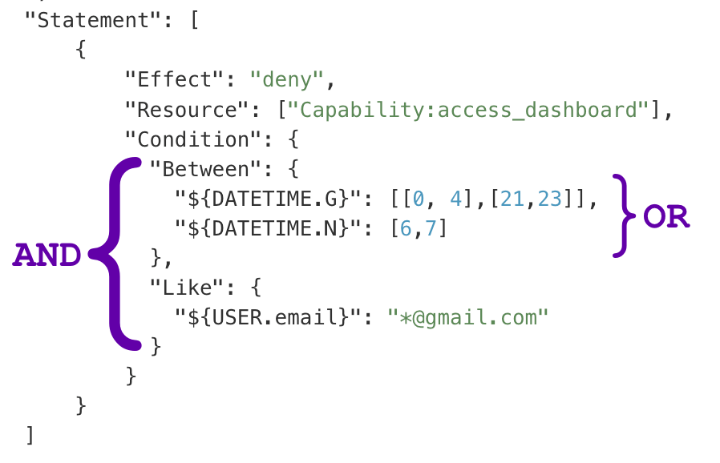

Any policy [Statement](/advanced/access-policy/policy-overview#statement) or [Param](/advanced/access-policy/policy-overview#param) may have one or more conditions that the current user or programmatic application has to satisfy for it to take applicable. For example, you may what to restrict access to the backend area during holidays like Christmas or Easter, or you need to remove the ability to comment on all posts from some IP address range.

Without further due, let's learn about conditions with the example of a policy that restricts access to the _backend_ area outside of regular 9 am to 5 pm business hours. Additionally, we restrict access to the _backend_ over the weekend.

```json
{
  "Statement": [
    {
      "Effect": "deny",
      "Resource": [
        "Capability:aam_access_dashboard"
      ],
      "Condition": {
        "Between": {
          "${DATETIME.G}": [
            [
              0,
              4
            ],
            [
              21,
              23
            ]
          ],
          "${DATETIME.N}": [
            6,
            7
          ]
        }
      }
    }
  ]
}
```

Another great power of conditions is that they may contain [markers](/advanced/access-policy/marker/).

Marker is a great way to inject dynamic data like a user’s IP address, current time, or values from a `POST` request, and check if this matches the condition. For example, you might want to allow access to certain posts only if a user’s email is `*@gmail.com`, or the current month is November.

You can provide more than one condition type. In the image below, all the conditions within one type are combined with logical `OR` operand while condition groups are combined with `AND` operand. This allows building conditions like – allowing access to edit pages if the user's name is "John Smith" or "Rebecca Ross" and they are coming from UK IP space.



Each condition group is an object with the key/value pair sets that combine with the `OR` logical operation. However, the condition group can also be an array of objects that are combined with the `AND` logical operator. It allows defining conditions like "User name is NotLike John* AND NotLike Kevin*". For example, the following policy restricts access to read all post but one for users that do not have email addresses with `@vasyltech.com` and `@gmail.com` domains.

```json
{
  "Statement": [
    {
      "Effect": "deny",
      "Resource": "PostType:post:posts",
      "Action": "Read"
    },
    {
      "Effect": "allow",
      "Resource": "Post:post:hello-world",
      "Action": "Read",
      "Condition": {
        "NotLike": [
          {
            "${USER.user_email}": "*@vasyltech.com"
          },
          {
            "${USER.user_email}": "*@gmail.com"
          }
        ]
      }
    }
  ]
}
```