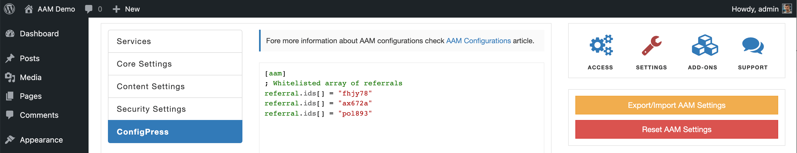

### Syntax

`${AAM_CONFIG.<pathToProperty>}`

### Definition

Fetch configurations that are defined with the [ConfigPress](/plugin/advanced-access-manager/configpress/).

In the following example, we define the list of valid referral strings with  ConfigPress and restrict access to the entire website (except the _backend_ area) if the HTTP query param `ref` is not whitelisted.



```json
{
    "Dependency": {
        "wordpress": ">=5.1.1",
        "advanced-access-manager": ">=6.1.0",
        "aam-complete-package": ">=6.0.0"
    },
    "Statement": [
        {
            "Effect": "deny",
            "Resource": "URI:*",
            "Condition": {
                "NotIn": {
                    "${HTTP_GET.ref}": "(*array)${AAM_CONFIG.referral.ids}"
                }
            }
        },
        {
            "Effect": "allow",
            "Resource": "URI:/wp-admin*"
        }
    ]
}
```

::: info Note!
Because we are using wildcard `URI:*`, `URI:/wp-admin*` definitions, the [premium Complete Package](/premium) add-on is required for this policy to work.
:::