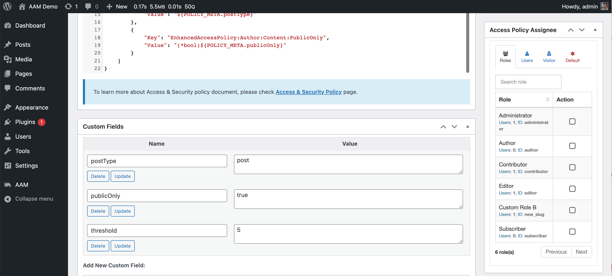

The `POLICY_META` marker references the [custom fields](https://wordpress.org/documentation/article/assign-custom-fields/) for the policy itself.

::: info FYI!
The AAM access policies are custom post types under the hood and have the same features as a regular post. The only difference is that policies can be managed only by administrators or highly privileged users.
:::



The following policy restricts a user from creating more than the allowed number of published posts.

```json
{
    "Statement": {
        "Effect": "deny",
        "Resource": "PostType:${POLICY_META.postType}:posts",
        "Action": "Create",
        "Condition": {
            "GreaterOrEquals": {
                "${CALLBACK.MyCustomPlugin::getPostCount}": "${POLICY_META.threshold}"
            }
        }
    },
    "Param": [
        {
            "Key": "Author:Content:PostType",
            "Value": "${POLICY_META.postType}"
        },
        {
            "Key": "Author:Content:PublicOnly",
            "Value": "(*bool)${POLICY_META.publicOnly}"
        }
    ]
}
```

And here is an example of the `MyCustomPlugin` class that implements the callback function.

```php
<?php

/**
 * Helper class that allows to obtain stats about author's writing
 *
 * @author Vasyl Martyniuk <vasyl@vasyltech.com>
 * @version 0.0.1
 */
class MyCustomPlugin
{

    /**
     * Get the number of user's posts
     *
     * @return int
     *
     * @access public
     * @version 0.0.1
     */
    public static function getPostCount()
    {
        $user_id = get_current_user_id();

        if (!empty($user_id)) {
            $manager   = \AAM::api()->getAccessPolicyManager();

            $type   = $manager->getParam('Author:Content:PostType');
            $public = $manager->getParam('Author:Content:PublicOnly');

            $response = count_user_posts(
                $user_id, ($type ?? 'post'), ($public ?? false)
            );
        } else {
            $response = 0;
        }

        return $response;
    }

}
```