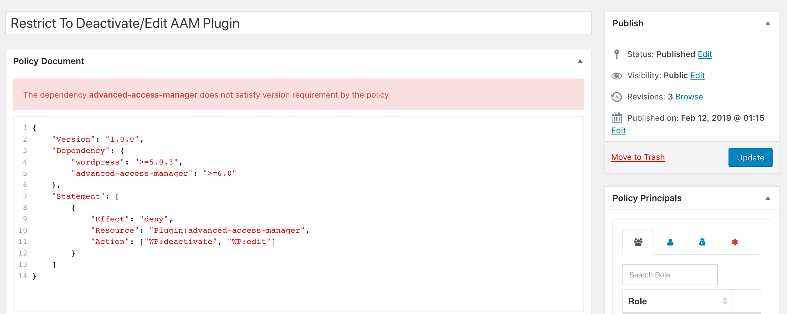

The access policy is a well-structured JSON document that contains one or more statements, params, and dependencies that collectively define access controls to a website’s resources and actions.

In general, a policy may have three main sections. All are optional and used depending on a policy intent.

```json
{
    "Dependency": {},
    "Statement": [],
    "Param": []
}
```
The remaining page briefly outlines the fundamental point for each section.

### Dependency

While the policy defines the access rules, there has to be a code that supports it. That is why a policy can declare the list of minimum required plugins and WordPress core versions in the `Dependency` section. Typically you find dependencies like `wordpress` or `advanced-access-manager` with the minimum required version.

```json
{
    "Dependency": {
        "wordpress": ">=5.8",
        "advanced-access-manager": ">=6.9.0"
    }
}
```

You will get a visual error notification on the policy edit screen if one or more dependencies do not satisfy the minimum required version. However, this does not necessarily mean the policy will not work properly. You would have to run additional tests to verify it.



Version definition uses [semantic versioning guidelines](https://semver.org/), and to make it consistent, AAM adopts the [NPM manages dependency](https://docs.npmjs.com/misc/semver) versioning syntax.

AAM 6.2.0+ allows defining extended details about depending plugin. There are no constraints as to how many attributes are provided. However, the `Version` is required.

```json
{
    "Dependency": {
        "wordpress": ">=6.0.0",
        "advanced-access-manager": ">=6.2.0",
        "aam-complete-package": {
            "Version": ">=6.0.0",
            "Name": "AAM Complete Package",
            "URL": "https://aamportal.com/premium"
        }
    }
}
```

If the dependency definition contains a valid `URL` attribute, AAM renders the error message with the link to the defined location.


### Statement

The `Statement` section contains one or more policy statements that define access to resources and actions. Statements can be conditional and are applicable only when declared conditions are met. For example, the following statement denies commenting on all posts if a user is not from the US.

```json
{
    "Statement": {
        "Effect": "deny",
        "Resource": "PostType:post:posts",
        "Action": "Comment",
        "Condition": {
            "NotEquals": {
                "${IPSTACK.country_code}": "US"
            }
        }
    }
}
```

The `Effect` property determines if access is allowed or denied to a specified list of resources and actions. And there are two acceptable values - `allow` or `deny`. Any other value is treated as `deny`.

The example statement below restricts access to any WordPress backend endpoint between midnight and 7 am (based on the local server’s time).

```json
{
    "Effect": "deny",
    "Resource": [
        "URI:/wp-admin/*"
    ],
    "Condition": {
        "Between": {
            "${DATETIME.h}": [
                0,
                7
            ]
        }
    }
}
```

With an increasing number of statements and separate policies, it is common to make mistakes and target the same resource or action with different effects (one may allow access to all pages, while the other - denies it). To ensure that access controls to the most critical resources and enforced, use the `Enforce` boolean property.

::: info FYI!
If you are familiar with CSS, the `Enforce` property acts like the [!important](https://developer.mozilla.org/en-US/docs/Web/CSS/Specificity#The_!important_exception) tag that forces specific rule.
:::

For example, the [Role](/advanced/access-policy/resource-action/role) resource assigns all the capabilities, that the role has to the assignee. If  the specified role gets unwanted capabilities, that may create a security incident. With the `Enforce` property, you ensure that the most important capabilities are denied.

```json
{
    "Statement": [
        {
            "Effect": "deny",
            "Enforce": true,
            "Resource": [
                "Capability:edit_posts",
                "Capability:edit_pages"
            ]
        },
        {
            "Effect": "allow",
            "Resource": "Role:editor"
        }
    ]
}
```

### Param

Last but not least, a policy may carry some parameters that support statements or are used to override any WordPress core options.

Each param has the `Key` and `Value` properties. The param's key can be used with [POLICY_PARAM](/advanced/access-policy/marker/policyparam) marker or in the code to programmatically fetch its value.

::: code-tabs

@tab json

```json
{
    "Param": [
        {
            "Key": "post:default:category",
            "Value": 345
        }
    ]
}
```

@tab php

```php
// This code will return int value 345 if current user has
// Param `post:default:category` defined in attached policy
AAM::api()->getAccessPolicyManager()->getParam('post:default:category');
```

:::

The param can also override any website option that you can fetch with the [get_option](https://developer.wordpress.org/reference/functions/get_option/) or [get_site_option](https://developer.wordpress.org/reference/functions/get_site_option/) WordPress core functions. Just prefix the key with the `option:`.

```json
{
    "Param": [
        {
            "Key": "option:users_can_register",
            "Value": 0,
            "Condition": {
                "In": {
                    "${DATETIME.D}": [
                        "Sat",
                        "Sun"
                    ]
                }
            }
        }
    ]
}
```
The param above overrides the WordPress core option `users_can_register` and allows registration on the site only during weekdays.