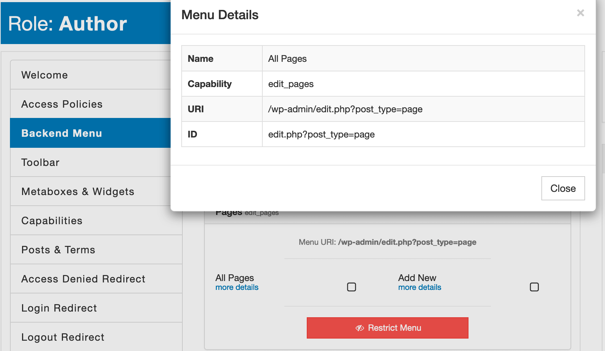

### Syntax

`BackendMenu:<menu-id>`

### Definition

The WordPress core does not have the true concept of a unique _menu id_. The uniqueness of each menu or submenu item determins by its URI (e. g. `edit.php?post_type=page` or `options-reading.php`).

With AAM 6.0.0 or higher, we attempted to make it easier to find a correct URI for any specific menu item. Navigate to the [Backend Menu](/plugin/advanced-access-manager/service/backend-menu) tab, and each menu item includes the _more details_ link. The **ID** attribute is the one that you should use with the `BackendMenu` resource.



The following statement hides and denies direct access to the "Tools->Import" page.

```json
{
    "Statement": [
        {
            "Effect": "deny",
            "Resource": "BackendMenu:import.php"
        }
    ]
}
```

When you need to restrict access to the whole menu item with all the sub-items (e. g. _Plugins_ or _Appearance_), then prepend the menu ID with the `menu-` prefix. In the example statement below, we deny access to see or manage the _Plugins_ menu with all submenus.

```json
{
    "Statement": [
        {
            "Effect": "deny",
            "Resource": [
                "BackendMenu:menu-plugins.php"
            ]
        }
    ]
}
```

::: info FYI!
AAM restricts direct access to a page linked to the protected menu item.
:::

With the premium [Complete Package](/premium) we also added the ability to use the wildcard `*` denotation to target all menus and submenus. It is helpful when you need to grant access only to a few menu items and ensure that if a new or existing plugin introduces a new menu, it is protected unless you explicitly allow it.

For example, the statement below restricts access to all the menu items except the _Posts_.

```json
{
    "Statement": [
        {
            "Effect": "deny",
            "Resource": [
                "BackendMenu:*"
            ]
        },
        {
            "Effect": "allow",
            "Resource": [
                "BackendMenu:menu-edit.php"
            ]
        }
    ]
}
```

::: info Note!
AAM does not allow restricting access to the _Dashboard_ menu `/wp-admin/index.php` because it is the default redirect page all users after login. To completely restrict access to the entire backend area, consider [locking down the backend area](/question/backend-access/lockdown-backend-area).
:::