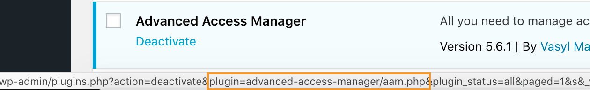

### Syntax

`Plugin`<br/>
`Plugin:<plugin-slug>`

If no `plugin-slug`provided, all plugins are assumed.

### Definition

AAM treats each plugin as a separate resource that is identified by the unique plugin’s slug. The easier way to find the correct plugin’s slug is to go to the `wp-content/plugins` folder and the name of the plugin’s folder is the _slug_.

The other way is to go to the _Plugins_ page and hover on the desired plugin. The URL will contain the query parameter with the plugin’s _slug_ as shown in the screenshot below.



The `Plugin` resource supports several actions as follows.

- `WP:list`. Ability to remove/hide the specific plugin from the list of plugins.
- `WP:activate`. Ability to activate specific plugins.
- `WP:deactivate`. Ability to deactivate specific plugins;
- `WP:delete`. Ability to delete any plugin. Extends the default WordPress core capability [delete_plugins](https://wordpress.org/documentation/article/roles-and-capabilities/#delete_plugins)
- `WP:install`. Ability to install any plugin. Extends the default WordPress core capability [install_plugins](https://wordpress.org/documentation/article/roles-and-capabilities/#install_plugins).
- `WP:update`. Ability to update any plugin. Extends the default WordPress core capability [update_plugins](https://wordpress.org/documentation/article/roles-and-capabilities/#update_plugins).
- `WP:edit`. Ability to edit any plugin. Extends the default WordPress core capability [edit_plugins](https://wordpress.org/documentation/article/roles-and-capabilities/#edit_plugins).

In the example below we hide and restrict the ability to deactivate the AAM plugin.

```json
{
    "Statement": [
        {
            "Effect": "deny",
            "Resource": [
                "Plugin:advanced-access-manager"
            ],
            "Action": [
                "WP:list",
                "WP:deactivate"
            ]
        }
    ]
}
```

The following statement restricts the ability to update or deactivate all the plugins.

```json
{
    "Statement": [
        {
            "Effect": "deny",
            "Resource": "Plugin",
            "Action": [
                "WP:update",
                "WP:deactivate"
            ]
        }
    ]
}
```