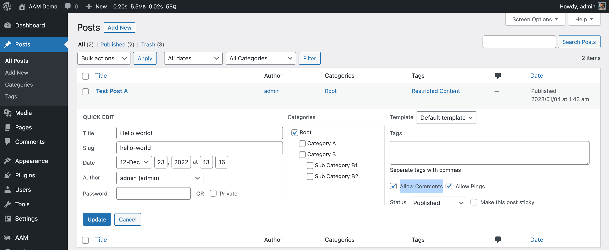

### Syntax

`Post:<post-type-key>:<ID|slug>`

The `post-type-key` has to exactly match the post type key for the registered post type with [register_post_type](https://developer.wordpress.org/reference/functions/register_post_type/). For example, the regular WordPress _posts_ use the post type key `post`, and pages - `page`.

### Definition

Redefine how users can access a _post_. Under post we mean any post, page, media library item or custom post type. Basically any record stored in the _wp_posts_ database table.

Each _post_ is identified internally by three attributes:
post type (e. g. `post`, `page`, `product`, `attachment`).
post ID (e. g. `174`, `12`, `89`).
slug aka post name (e. g. `hello-world`, `first-post`).
When defining the `Post` resource, you explicitly provide the post type and either post ID or slug. For example if you need to restrict to edit and delete the page "Contact" (ID `78` and slug `contact`) the following statements are idential and will do the magic.

```json
{
    "Statement": [
        {
            "Effect": "deny",
            "Resource": "Post:page:78",
            "Action": [
                "Edit",
                "Delete"
            ]
        }
    ]
}
```
```json
{
    "Statement": [
        {
            "Effect": "deny",
            "Resource": "Post:page:contact",
            "Action": [
                "Edit",
                "Delete"
            ]
        }
    ]
}
```

::: info FYI!
We recommend using post slugs instead of post IDs in your policies to keep them compatible across multiple website environments and to improve policy readability. For example, if you have a local instance of a website, staging, and production, a page with the same name may have different IDs.
:::

The `Post` resource supports several [actions](/advanced/access-policy/policy-overview#action) that define more granular access to what users can or cannot do with the `post`. However, note that the access policy is area-agnostic. It does not differentiate between _frontend_, _backend_, and API areas. So if a statement restricts access to read a _post_, it restricts in all areas. It significantly simplifies and enhances your website access and security management. But, if you need to be more specific about where access controls should be applicable, use [conditions](/advanced/access-policy/condition/).

### Read Action

Manage the ability to read or directly access a _post_. However, note that this does not hide the _post_ link in the search results, list of posts, menu, etc. To hide the _post_, use the [List](/advanced/access-policy/resource-action/post#list-action) action.

The following statement restricts to read some posts, pages and custom post types.

```json
{
    "Statement": [
        {
            "Effect": "deny",
            "Resource": [
                "Post:page:members-only",
                "Post:post:how-does-membership-pricing-work",
                "Post:course:introduction-to-ecommerce",
                "Post:course:advanced-email-marketing"
            ],
            "Action": "Read"
        }
    ]
}
```

You can fine-tune how direct access to a _post_ is protected with additional configurations. For example, you may want to protect your content with a password or show a teaser message instead. Last but not least, maybe you want to redirect the user to a different location. The additional property `Metadata` in the statement allows you to do so.

The `Password` metadata declares a password to access the restricted _post_. You can define the password directly in the statement as a string or dynamically injected with a [marker](/advanced/access-policy/marker/). In the example statement below, the password is declared as a constant `WORDCAMP_PASSWORD` in the `wp-config.php` file, and the post `wordcamp-material` is password protected between April 1st and April 30th, 2023.

```json
{
    "Statement": {
        "Effect": "deny",
        "Resource": "Post:post:wordcamp-material",
        "Action": "Read",
        "Metadata": {
            "Password": {
                "Value": "${CONST.WORDCAMP_PASSWORD}"
            }
        },
        "Condition": {
            "Between": {
                "${DATETIME.y-m-d}": [
                    "2023-04-01",
                    "2023-04-30"
                ]
            }
        }
    }
}
```

The `Teaser` metadata declares the teaser message instead of the _posts_ content. In other words, a user can directly access the _post_, however, instead of its content, they see the defined teaser message. The message can be plain text or rich HTML with embedded [shortcodes](https://codex.wordpress.org/Shortcode).

The common use case for the teaser message is to show the end user that certain content is available for logged-in users or paid members. In the example statement below the custom callback function `ContentLimiter::generateTeaserMessage` returns the teaser message instead of the "Introduction to AWS" E-book page if the user does not have the Gold tier.

```json
{
    "Statement": {
        "Effect": "deny",
        "Resource": "Post:ebook:introduction-to-aws",
        "Action": "Read",
        "Metadata": {
            "Teaser": {
                "Value": "${CALLBACK.ContentLimiter::generateTeaserMessage}"
            }
        },
        "Condition": {
            "NotIn": {
                "gold": "(*array)${USER.roles}"
            }
        }
    }
}
```

The `Redirect` metadata allows defining the HTTP redirect to a different page or URL. The redirect happens before the _post_ content renders, so the end-user does not see the restricted content.

Currently, we support three different types of redirects.
- Redirect to a different page by _slug_ or _ID_.
- Redirect to a different URL within the allowed hosts (AAM performs the safe redirect with the core WordPress function [wp_safe_redirect](https://developer.wordpress.org/reference/functions/wp_safe_redirect/)).
- Trigger a callback function that performs redirect.

If the redirect type is either `page` or `URL`, you can set any HTTP redirect code as recommended by [MDN](https://developer.mozilla.org/en-US/docs/Web/HTTP/Redirections) as following.

```json
{
    "Statement": {
        "Effect": "deny",
        "Resource": "Post:post:postman-testing",
        "Action": "Read",
        "Metadata": {
            "Redirect": {
                "Type": "page",
                "Slug": "authentication-required",
                "Code": 301
            }
        }
    }
}
```

Similarly, you can use page ID instead of slug.

```json
{
    "Statement": {
        "Effect": "deny",
        "Resource": "Post:post:postman-testing",
        "Action": "Read",
        "Metadata": {
            "Redirect": {
                "Type": "page",
                "ID": 76,
                "Code": 307
            }
        }
    }
}
```

::: info FYI!
If HTTP redirect code is not provided, the default is `307 (Temporary Redirect)`.
:::

When you need a custom callback function to redirect, use the `callback` type instead. **It is important** that the provided callback function redirects and halts the further code execution with `exit` or `die` statement. Otherwise there is a chance that WordPress core will render the protected content.

```json
{
    "Statement": {
        "Effect": "deny",
        "Resource": "Post:post:postman-testing",
        "Action": "Read",
        "Metadata": {
            "Redirect": {
                "Type": "callback",
                "Callback": "MyCustomRedirectFunction"
            }
        }
    }
}
```


### ReadByOthers Action

::: info Premium Feature
Available with the [Complete Package](/premium).
:::

Similarly to the [Read](/advanced/access-policy/resource-action/post#read-action) action, managing the ability to read or directly access a _post_ by a user with the same role as the _post_ author. However, if the policy is applied to everybody (available only with the premium [Complete Package](/premium)), then it truly allows accessing the _post_ only for the author.

This action is useful to protect users' posts from others. For example, let's say you have a group of subscribers that use your website for their digital diary. Applying the policy to the _Subscriber_ role, ensuring that all subscribers can read only their diary entries and not others.

```json
{
    "Statement": [
        {
            "Effect": "deny",
            "Resource": [
                "Post:post:my-personal-journey"
            ],
            "Action": "ReadByOthers"
        }
    ]
}
```

### List Action

Manage a _post_ visibility. In other words - hide the _post_, however, allow direct access with the URL. To protect the _post_ from accessing it, use the [Read](/advanced/access-policy/resource-action/post#read-action) action.

The following statement hides a few pages even if the page is part of any menu or fetched via RESTful API.

```json
{
    "Statement": [
        {
            "Effect": "deny",
            "Resource": [
                "Post:page:discounts",
                "Post:page:123"
            ],
            "Action": "List"
        }
    ]
}
```

### ListToOthers Action

::: info Premium Feature
Available with the [Complete Package](/premium).
:::

Similarly to [List](/advanced/access-policy/resource-action/post#list-action), manage a _post_ visibility to a user with the same role as the _post_ author. However, if the policy is applied to everybody (available only with the premium [Complete Package](/premium)), then it truly allows showing the _post_ only for the author.

The following statement hides the "John's Personal Info" page for everybody except him if the statement applies to the [default access level](/question/aam/what-is-access-controls-inheritance).

```json
{
    "Statement": [
        {
            "Effect": "deny",
            "Resource": [
                "Post:page:john-personal-info"
            ],
            "Action": "ListToOthers"
        }
    ]
}
```

### Comment Action

Determine if the commenting feature is enabled for a _post_. It basically controls the WordPress core native "Allow Comments" feature.



In the policy below, we restrict commenting for the post if user is unauthenticated.

```json
{
    "Statement": {
        "Effect": "deny",
        "Resource": "Post:post:idea-board",
        "Action": "Comment",
        "Condition": {
            "Equals": {
                "(*bool)${USER.isAuthenticated}": false
            }
        }
    }
}
```

### Edit Action

Manage the ability to edit a _post_. If denied, the user will not be able to make changes to the _post_ through the _backend_ or RESTful API unless [conditioned](/advanced/access-policy/condition/) differently.

The following statement restricts a user from editing the page with ID 45.

```json
{
    "Statement": {
        "Effect": "deny",
        "Resource": "Post:page:45",
        "Action": "Edit"
    }
}
```

### EditByOthers Action

::: info Premium Feature
Available with the [Complete Package](/premium).
:::

Similarly to the [Edit](/advanced/access-policy/resource-action/post#edit-action) action, managing the ability to edit a _post_ by a user with the same role as the _post_ author. However, if the policy is applied to everybody (available only with the premium [Complete Package](/premium)), then it truly allows editing the _post_ only by the author.

The example statement below denies editing a couple pages that all editors except those who created them.

```json
{
    "Statement": {
        "Effect": "deny",
        "Resource": [
            "Post:page:sample-page-one",
            "Post:page:sample-page-two"
        ],
        "Action": "EditByOthers"
    }
}
```

### Delete Action

Manage the ability to delete a _post_ (move to trash). If denied, the user will not be able to delete a _post_ through the _backend_ or RESTful API unless [conditioned](/advanced/access-policy/condition/) differently.

The following statement restricts a user to delete the page "Home".

```json
{
    "Statement": {
        "Effect": "deny",
        "Resource": "Post:page:home",
        "Action": "Delete"
    }
}
```

### DeleteByOthers Action

::: info Premium Feature
Available with the [Complete Package](/premium).
:::

Similarly to the [Delete](/advanced/access-policy/resource-action/post#delete-action) action, managing the ability to delete a _post_ by a user with the same role as the _post_ author. However, if the policy is applied to everybody (available only with the premium [Complete Package](/premium)), then it truly allows deleting the _post_ only by the author.

The example statement below denies deleting a couple posts that all users except those who created them.

```json
{
    "Statement": {
        "Effect": "deny",
        "Resource": [
            "Post:post:science-introduction",
            "Post:page:history-introduction"
        ],
        "Action": "DeleteByOthers"
    }
}
```

### Publish Action

Manage the ability to publish a draft _post_. If denied, the user will not be able to publish a draft the _post_ through the _backend_ or RESTful API unless [conditioned](/advanced/access-policy/condition/) differently. However, if the _post_ is already published, the action has no effect.

The following statement restricts a user from publishing the page "Discounts".

```json
{
    "Statement": {
        "Effect": "deny",
        "Resource": "Post:page:discounts",
        "Action": "Publish"
    }
}
```

### PublishByOthers Action

::: info Premium Feature
Available with the [Complete Package](/premium).
:::

Similarly to the [Publish](/advanced/access-policy/resource-action/post#publish-action) action, managing the ability to publish a draft _post_ by a user with the same role as the _post_ author. However, if the policy is applied to everybody (available only with the premium [Complete Package](/premium)), then it truly allows publishing a draft _post_ only by the author.

The example statement below denies publishing a _post_ by all users except author.

```json
{
    "Statement": {
        "Effect": "deny",
        "Resource": [
            "Post:post:science-introduction"
        ],
        "Action": "PublishByOthers"
    }
}
```