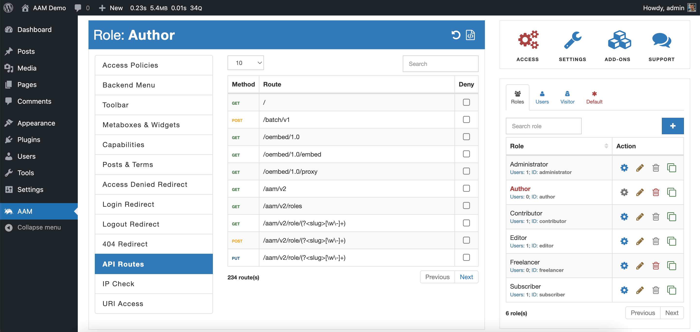

### Syntax

`Route:RESTful:<endpoint>:<http-verb>`

::: info Note!
All API route resources start with the `Route:RESTful:` prefix. It was formed historically, because AAM was used to support XML-RPC endpoints. However, due to several technical constraints, we dropped the support for XML-RPC API in AAM 6.0.0.
:::

### Definition

Manage access to an individual WordPress RESTful API endpoint (route). Each endpoint identifies by two attributes:
- `route` is the exact match of the `$route` parameter provided for the [register_rest_route](https://developer.wordpress.org/reference/functions/register_rest_route/) function.
- `http-verb` is the HTTP method for the endpoint
You can find both attributes with the help of the AAM [API Routes](/plugin/advanced-access-manager/service/api-route) service.



The example statement below restricts access to the `POST /wp/v2/posts` endpoint (basically does not allow creating new posts).

```json
{
    "Statement": {
        "Effect": "deny",
        "Resource": "Route:RESTful:/wp/v2/posts:POST"
    }
}
```

The premium [Complete Package](/premium) introduces the wildcard `*` denotation to target a group of endpoints. The wildcard can be used instead of the `endpoint, `http-verb`, or both.

For example, the statement below restricts any API requests to the `/wp/v2/posts` endpoint.

```json
{
    "Statement": {
        "Effect": "deny",
        "Resource": "Route:RESTful:/wp/v2/posts:*"
    }
}
```

The following statement restricts all RESTful API endpoints.

```json
{
    "Statement": {
        "Effect": "deny",
        "Resource": "Route:*:*"
    }
}
```