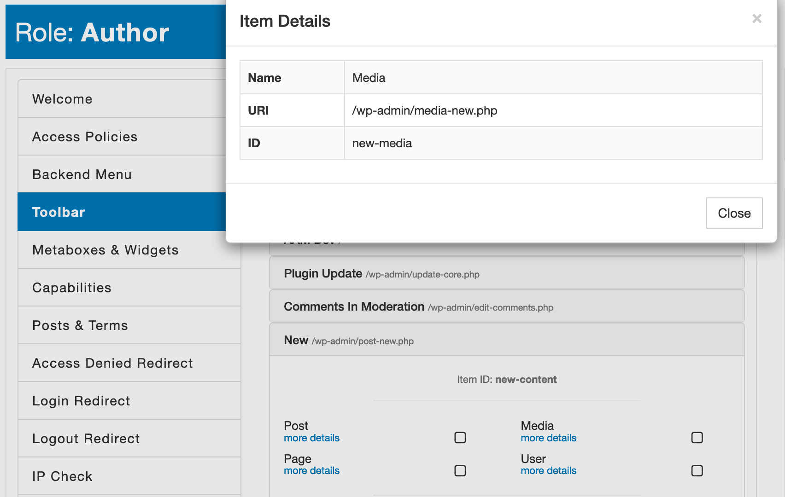

### Syntax

`Toolbar:<toolbar-id>`

### Definition

Because the top admin toolbar is just a convenient set of shortcodes to actual admin pages, AAM does not restrict access to a page the toolbar item links to. You should apply additional access and security measures to protect access to a linked page.

Each item on the top admin toolbar identifies by a unique slug that you can find on the [Toolbar](/plugin/advanced-access-manager/service/toolbar) tab. Use the "slug" to define proper `Toolbar` resources while preparing policy statements.



The example statement below removes the "New->Media" toolbar item.

```json
{
    "Statement": [
        {
            "Effect": "deny",
            "Resource": [
                "Toolbar:new-media"
            ]
        }
    ]
}
```

The premium [Complete Package](/premium) adds the ability to use the wildcard `*` denotation to target all toolbar items. For example, in the following statement, we restrict access to all the items on the top admin toolbar.

```json
{
    "Statement": [
        {
            "Effect": "deny",
            "Resource": [
                "Toolbar:*"
            ]
        }
    ]
}
```

::: info FYI!
Keep in mind that you also have the ability to remove the entire top admin toolbar on the frontend. Check the [How to remove toolbar on the frontend?](/question/frontend-access/remove-toolbar) Q&A.
:::