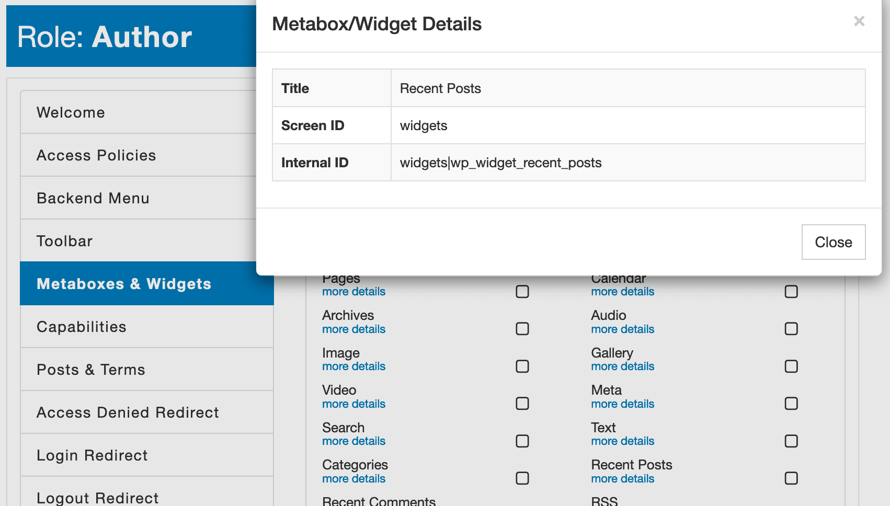

### Syntax

`Widget:<widget-internal-id>`

### Definition

The `Widget` is similar to the [Metabox](/advanced/access-policy/resource-action/metabox) resource. The difference is that widgets are rendered on the _frontend_ or the _backend_ "Dashboard" page. They identify by their unique internal ID that you can find on the [Metaboxes & Widgets](/plugin/advanced-access-manager/service/metabox-widget) tab.



::: warning Note!
AAM only filters out widgets that are not allowed. It does not take into consideration the functionality that facilitates those widgets. Any user may reverse engineer how your website is set up and submit data that hidden widgets collect.
:::

Below is an example of the statement that removes the "Search "widget from the frontend sidebar if a user is authenticated and the email account is not registered with Gmail or Yahoo.

```json
{
    "Statement": [
        {
            "Effect": "deny",
            "Resource": "Widget:widgets|wp_widget_search",
            "Condition": {
                "Equals": {
                    "(*bool)${USER.isAuthenticated}": true
                },
                "NotLike": [
                    {
                        "${USER.user_email}": "*@gmail.com"
                    },
                    {
                        "${USER.user_email}": "*@yahoo.com"
                    }
                ]
            }
        }
    ]
}
```

The premium [Complete Package](/premium) adds the ability to use the wildcard `*` denotation to target all widgets. For example, the statement below restricts access to all the widgets on the _backend_ "Dashboard" page and the _frontend_.

```json
{
    "Statement": [
        {
            "Effect": "deny",
            "Resource": [
                "Widget:*"
            ]
        }
    ]
}
```