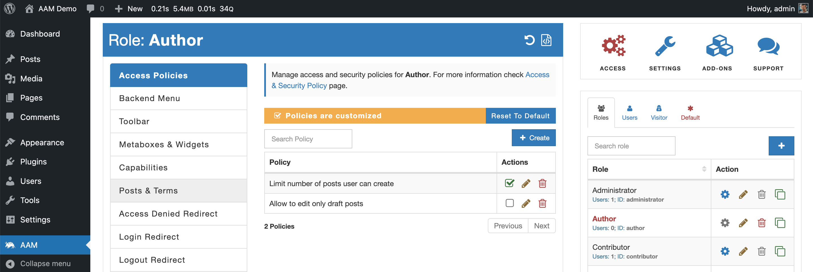
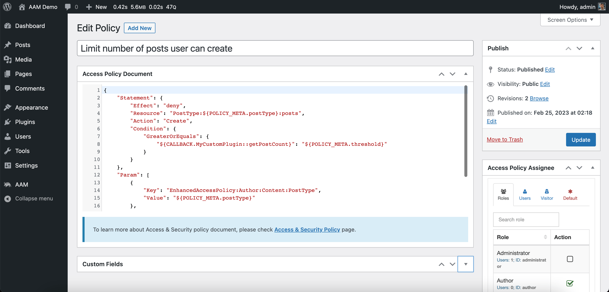
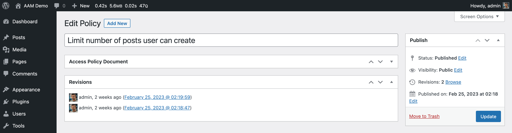

The access policy, in its nutshell, is a custom post type, so it has a similar UI as any post or page. The difference is in who can access policies and how the list of policies is displayed.

When you navigate to the [AAM Access](/plugin/advanced-access-manager/ui-overview#access-page) page, you can find the "Access Policies" tab that renders the list of all known policies on the site. Here you can manage the list of existing policies and create new ones.

::: info Note!
If you do not see the "Access Policies" tab as administrator, you likely have the "Access Policies" service disabled. Go to the AAM Settings page and search for the _access policies_ on the "Services" tab. Then enable the service.
:::

The policy edit screen has similar look and feels to the classical post edit page. Here you can prepare a policy document, assign it to any role, user, visitor, or to everyone, and publish a ready policy.

Another good part about access policies is that WordPress core automatically stores all the policy revisions. You can quickly find out who made the changes, when, and if necessary, revert to a previous revision.

::: info FYI!
You can toggle what widgets to display on the policy edit screen by selecting the "Screen Options" button on the top corner of the screen.
:::