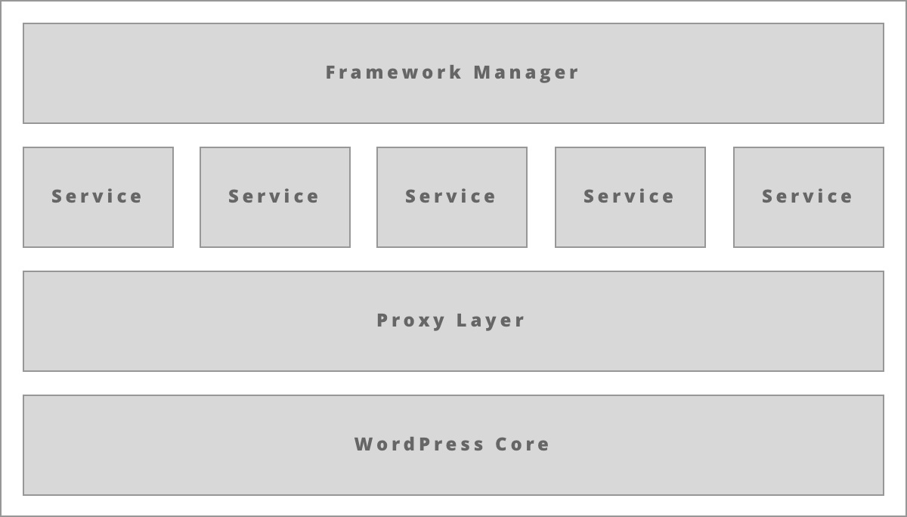

The [Advanced Access Manager](/plugin/advanced-access-manager/) plugin comes with embedded developer API that you can use to speed up your development efforts.

WordPress core has many classes, functions, and methods that may have misleading naming or may/may not be available depending on how you interact with the website. For example, did you know that the WordPress core function [get_editable_roles](https://developer.wordpress.org/reference/functions/get_editable_roles/) is only available when you work with _backend_? Or, maybe you were wondering what the [WP_Role](https://developer.wordpress.org/reference/classes/wp_role/) property `$name` contains. (it takes the role's slug and **not** the actual name).

The AAM Developer API is a humble way to abstract out all the knowledge we obtained through the years by maintaining one of the most popular WordPress plugins in the space of user-role management. It promotes standardization, consistency, and best practices for naming (all input values are carefully sanitized and validated).

The framework is organized in a simple and intuitive way as follows.

The **Framework Manager** is the recommended entry point to the framework. It exposes several static methods that return singleton instances of desired **Service**.

The **Service** is a logically grouped collection of methods that allows you to work with WordPress core directly or to define access controls to your website resources through AAM.

The **Proxy Layer** is both an enrichment and transformation layer to standardize naming and improve code readability. For example, when you request a single role by the slug, you receive back a proxy object [AAM_Framework_Proxy_Object](advanced/api/proxy/role) instead of raw `WP_Role`. All proxy objects allow you to access raw WordPress core object properties if needed.

The **WordPress Core** is the native WordPress functionality the AAM framework deeply integrates. The majority of the _services_ heavily depend on WordPress core functions and classes. The framework is smart enough to know under which circumstances certain WordPress core functionality may or may not be available.