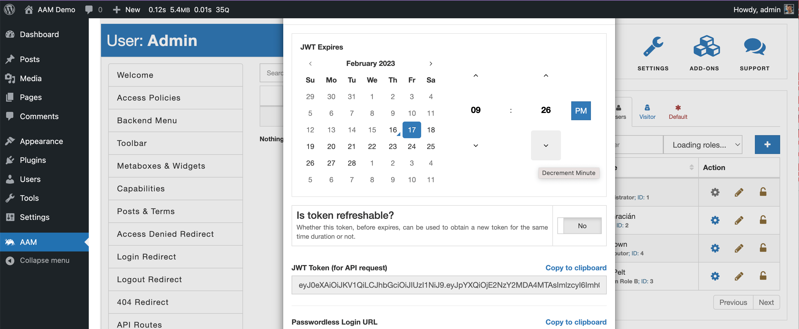

All new RESTful API endpoints require authentication and are authorized based on the current user capabilities. This documentation has a detailed explanation for each new endpoint and a list of required capabilities.

You have several ways to authenticate RESTful API calls. You may choose one of the authentication methods described in the [WordPress Authentication](https://developer.wordpress.org/rest-api/using-the-rest-api/authentication/) article. Alternatively, you can generate a JWT token with AAM and pass it as the `Authorization` header in your API requests. The remainder of this page describes authentication with a JWT token.

To generate the valid JWT token for the API, choose the existing WordPress user that satisfies one of the following conditions:

If the [aam_manager](/plugin/advanced-access-manager/capability/aam_manager) custom capability is not registered in the system, the user has to be an _Administrator_.
If the custom capability [aam_manager](/plugin/advanced-access-manager/capability/aam_manager) is registered, then the user has to have it assigned and an additional one as outlined in the documentation below.

::: info FYI!
For more detail, refer to the [How to manage access to AAM page for other users?](/question/aam/manage-access-to-aam-for-other-users) Q&A.
:::

Go to the AAM page and switch to that user on the _Users & Roles_ widget. You should be able to see an additional service [JWT Tokens](/plugin/advanced-access-manager/service/jwt) where you can generate a token.

We recommend keeping the TTL (time-to-live) for the token short. You can always generate a new one or refresh the existing one either manually or programmatically.
