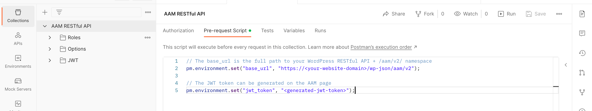

For your convenience, we prepared the Postman collection that you can use to start working with the RESTful API endpoints.

The only required step is to set the `base_url` and `jwt_token` environment variables, and you are good to go.

You may choose a different authentication method described on the [Authentication](/advanced/restful/authentication) page. In this case, adjust the Postman collection accordingly.

