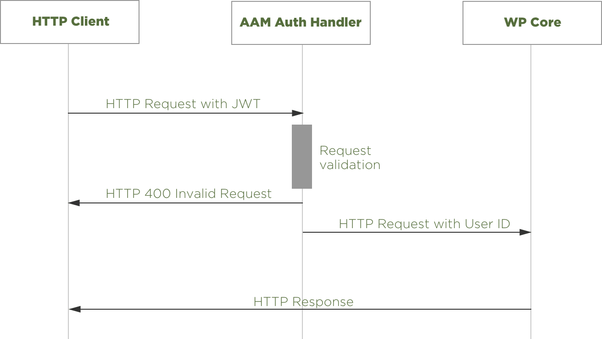

JWT tokens and user authentication are widely popular topics these days. It is commonly used for various cross-system integrations and because WordPress is the most popular CMS in the world, JWT authentication is arguably the #1 choice for custom development or inter-system integrations.

Per [IETF description](https://tools.ietf.org/html/rfc7519), _JSON Web Token (JWT) is a compact, URL-safe means of representing claims to be transferred between two parties_. So, in this quick crash course, we'll learn everything you need to know to start using JWT tokens effectively with the free version of the Advanced Access Manager (aka AAM) WordPress plugin.

::: info Note!
We also assume that:
- you know enough about the JWT concept and if you do not, please take some time to get familiar with it. The concept is super simple and can be mastered reasonably fast.
- you already have a properly installed WordPress instance and AAM plugin.
:::

Let's define the high-level picture for all the moving parts.

The JWT token is used to _authenticate_ an HTTP request to a WordPress website. When a JWT token is sent correctly, it tells a website's core something like "Hey, my name is Joe, and here is my identification (a JWT token) that was issued by the party that you trust".

JWT token does not authorize any activities, so technically it should not be used to implement any code that allows or denies specific actions (e.g. create a post, delete a user, update settings). The authorization part has to be controlled for the account that the JWT token represents and that is something we'll discuss down the road.

Below is the high-level diagram of how all this works.

The _HTTP Client_ (e.g. user's browser, application, Postman, Swagger, etc.) sends a request with included JWT token. It is validated by the _AAM Auth Handler_. If valid, AAM delegates the authenticated request to the _WP Core_ for further processing.

Because the JWT token is associated with an active website account, you can manage access to a website's resources and actions for that particular account. AAM has hundreds of features that you can utilize to define granular access as needed. To be compliant with enterprise-level security standards, you may use the [access policies](/advanced/access-policy/) and attach them to any user.

::: warning Note!
When a JWT token is valid, it does not necessarily mean that it can be successfully used because the associated account may no longer be active or the token revoked.
:::

Now, we established the base terminology and idea. So it is time to learn how to manage JWT tokens with AAM UI & RESTful API.