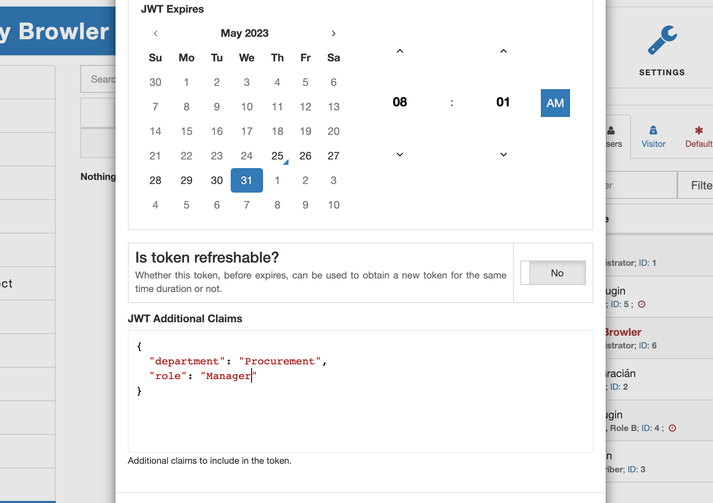

The entire idea behind a JWT token is to carry a limited amount of information (aka claims) while the integrity of them can be verified with a signature.

Without any customization, AAM issues JWT tokens with the following set of claims (example below):

```json
{
  "iat": 1686317969,
  "iss": "https://demo.aamportal.com",
  "exp": 1686404369,
  "jti": "94efb8e2-a4cc-477d-9891-bd8351cedc10",
  "refreshable": false,
  "revocable": true,
  "userId": 1
}
```

As you can see, it contains some standard claims like `iat`, `exp` or `jti`, and custom claims like `userId`, `revocable`, and `refreshable`.

::: info FYI!
In this course, we are not going to cover standard JWT claims. However, you can learn more about them from the official [JWT specification](https://datatracker.ietf.org/doc/html/rfc7519).
:::

### Custom claims

From the example above, AAM generates JWT tokens with three custom claims and we'll unpack each claim in greater detail.

- `userId` is a numeric value that is greater than 0 and represents an internal WordPress user ID. It is exactly the same number that the WordPress core function [get_current_user_id](https://developer.wordpress.org/reference/functions/get_current_user_id/) returns.
- `refreshable` is the unconventional way to declare if the token can be used to obtain a new token for the same time duration (calculated by the difference between `iat` and `exp`).
- `revocable` is the way to declare that the issued token is also registered in the internal tokens registry and an administrator or other privileged user can revoke it at any time.

### Extended claims

You have the ability to include additional claims in the token in two different ways.

- With AAM UI. When you issue a new token, the prompted modal allows you to declare additional claims.



- Programmatically with the help of [aam_jwt_claims_filter](/advanced/hooks/aam_jwt_claims_filter) filter.

```php
add_filter('aam_jwt_claims_filter', function($claims) {
    return array_merge(
        $claims,
        [
            'department' => get_user_meta($claims['userId'], 'user_department', true),
            'role'       => get_user_meta($claims['userId'], 'department_role', true)
        ]
    );
});
```

Last, but not least, we'll briefly cover all the configuration options that you can use to customize how the JWT tokens service works in the last chapter.