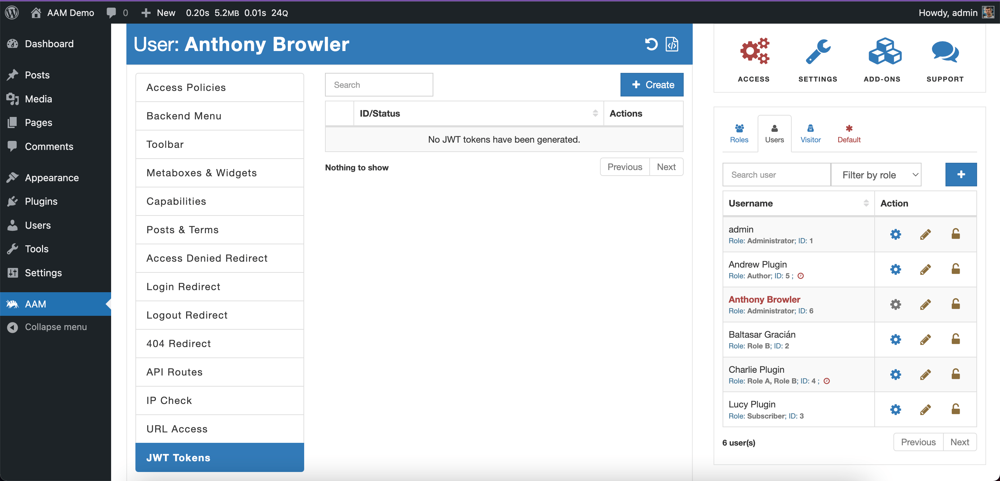
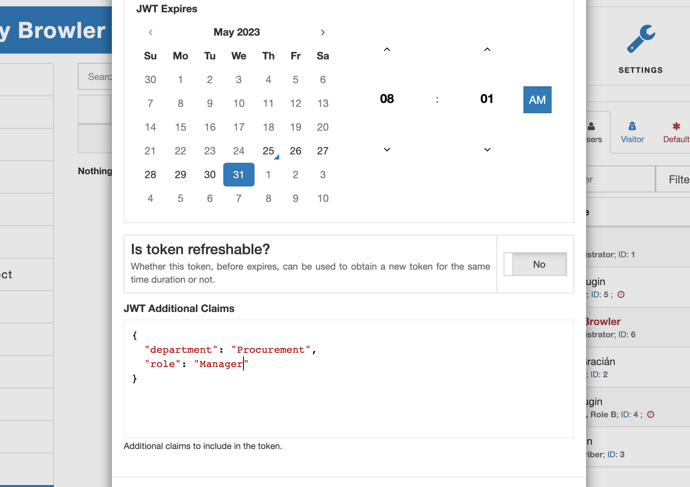
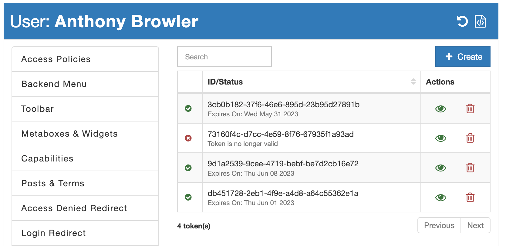
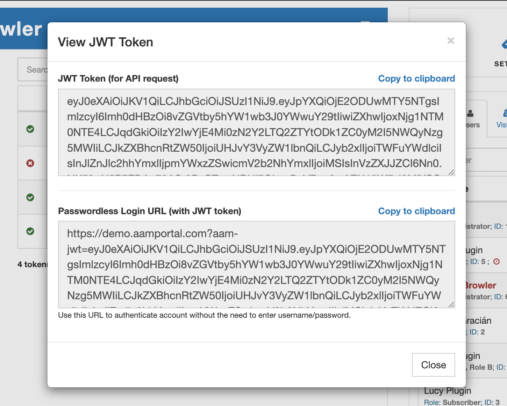

The free AAM version offers an easy-to-use user interface to manage JWT tokens for any individual user. Navigate to the AAM page and switch to any desired user, then the "JWT Tokens" tab appears in the Main area.

On this tab, you can issue a new token by selecting the "+ Create" button or manage existing tokens.

The "Create JWT Token" modal offers three distinct settings that allow customizing the token's properties further.
- The *JWT Expires* component gives you the opportunity to select the time in the future when the token expires (aka TTL). By default, the issuing token expires in 24 hours.
- The "Refreshable" flag determines if the issued token can be used to obtain a new token before the original expires. For example, if the original token is valid for 48 hours and expires in 6 hours, you can obtain a new token that will be valid for another 48 hours. This approach deviates from Auth 2.0 standard where only the "refresh token" can be used to obtain a new JWT token. We believe that this is cumbersome to manage two tokens for refresh purposes.
- The "JWT Additional Claims" component gives you the ability to include any custom claims into a token. You have to provide a valid JSON object and preferably a small one so you do not bloat the size of the token.

The list of all issued tokens is virtually stored separately for each user in the `wp_usermeta` database table as `wp_aam_jwt_registry`. We call it JWT token registry and the size of the registry is determined by the [service.jwt.registry_size](/plugin/advanced-access-manager/configpress/service-jwt-registry-size) option. The default number of tokens that can be stored per user is `10`, however, you can easily customize the desired number with [ConfigPress](/plugin/advanced-access-manager/configpress/).

The list provides the basic information about each token like expiration date, token ID, and a visual indicator if the token is still valid or not. The two actions of the "View Token" and the "Delete Token" allows you to preview token details or delete the token respectively.

When you select the "View Token" action, the modal displays a raw token as well as a signed URL that you can use to log in to the website. In other words, it is a passwordless URL that you can give to your user instead of a username/password pair.

::: info FYI!
To learn more about passwordless authentication, refer to the [What is the passwordless login?](/question/authentication/passwordless-login) Q&A.
:::

In the next chapter we'll learn how to manage JWT tokens with AAM RESTful API.