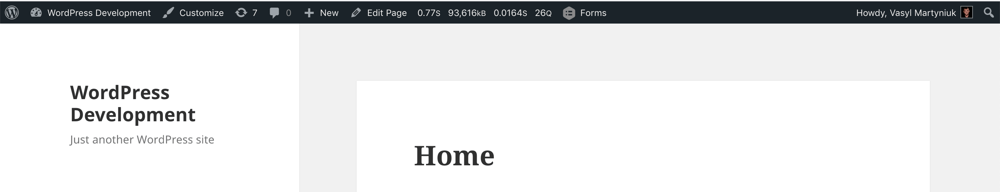
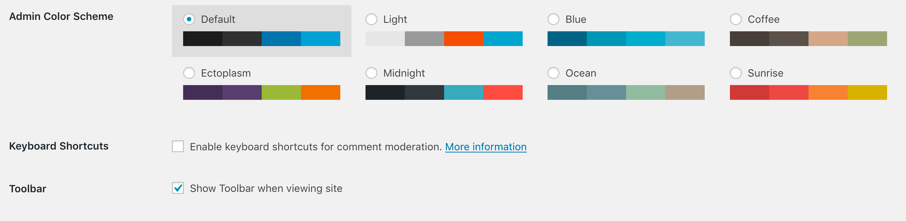

::: warning FYI!
It is the custom AAM capability you create if it does not exist. Upon creation, all users and roles that do not have this capability explicitly assigned, will not be to see the admin toolbar on the _frontend_.
:::

The top admin toolbar, by default, is shown on the _frontend_ after a user authenticates. It is not always needed, especially when the website administrator does not want other users to have access to the _backend_.

WordPress core already offers the ability to hide the top toolbar for any individual user. However, this process can be time-consuming because a webmaster has to go to each user's profile and deactivate the toolbar.

As an option, you can create a custom `aam_show_toolbar` capability and assign it only to roles or users that the toolbar can be shown.