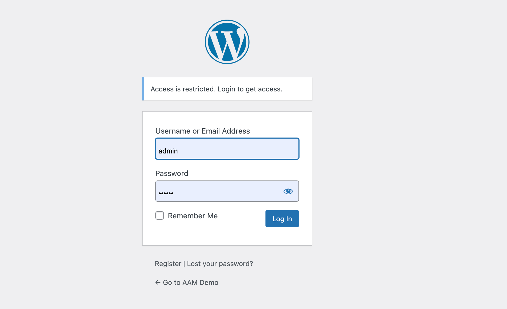

### Syntax

`service.secure_login.login_message = "string"`

The default value is: `Access is restricted. Login to get access.`

### Definition

The login message appears above the standard WordPress login form or any custom form/page that honors the WordPress core filter [login_message](https://developer.wordpress.org/reference/hooks/login_message/).

::: info FYI!
If you need to translate the message to a different language, use plugins that offer theme/plugin transaction. There are several good translation plugins in the WordPress.org official repository.
:::