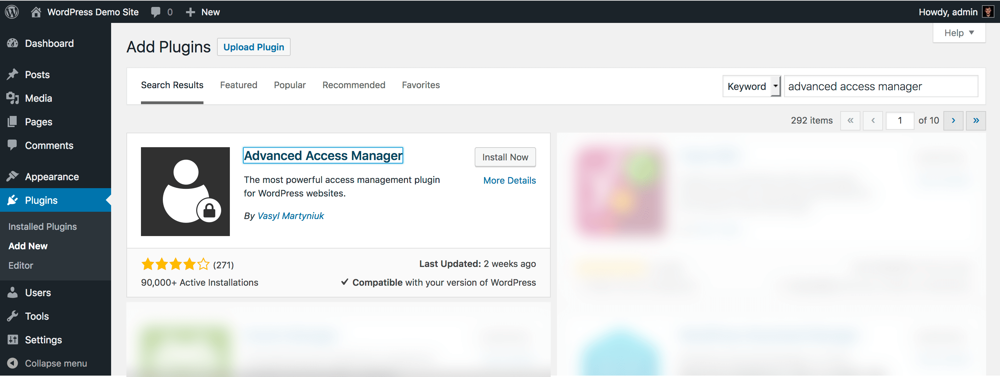

AAM is a free WordPress plugin published on [the official WordPress plugin repository](https://wordpress.org/plugins/advanced-access-manager/). To install it, go to your WordPress website backend area and navigate to the `Plugins->Add New`. Search for the _Advanced Access Manager_ and install it on your website.

Upon AAM activation, no additional steps required. The new `AAM` menu item will appear in the admin menu.

::: info FYI!
By default, AAM is allowed for any user that belongs to the WordPress standard _Administrator_ role. If there is more than one administrator on a website, consider defining which administrator user(s) can manage access. For more detail, check the "[How to manage access to AAM page for other users?](/question/aam-ui/manage-access-to-aam-for-other-users)" article.
:::
