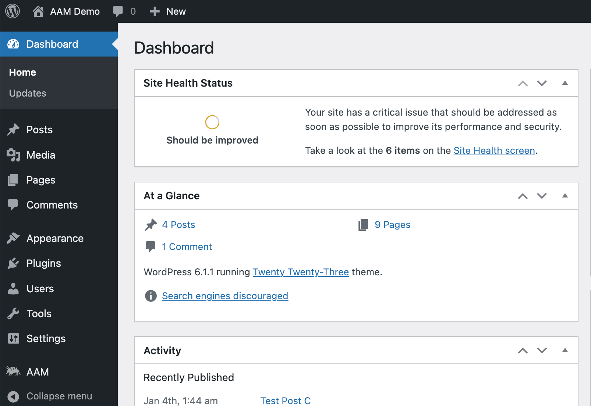
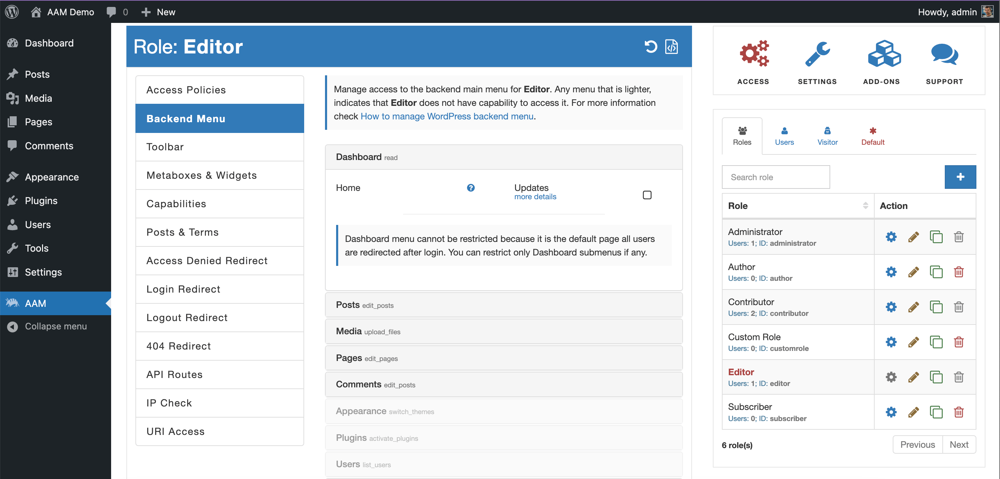
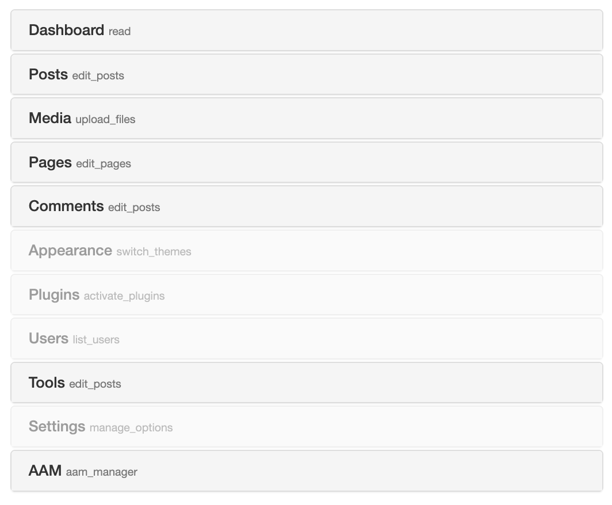

::: info Quick Facts
- **It is free**. Our users noted that the comparable functionality cost $20-$60 elsewhere.
- No coding is required.
- Hide any backend menu item and restrict direct access to the linked admin page.
- Customize access to the backend menu per role or even individual user.
- Three levels of access settings. You can manage access to all users at once or override access for any specific role or user.
- Easy way to find the assigned capability to any menu item. You do not have to dig into code anymore.
- Powerful and easy-to-use development API to create custom functionality.
- Some edge cases may not allow you to manage access to the menu items with UI. In this case, you can supplement with [access policies](/advanced/access-policy/resource-action/backendmenu).
:::

The WordPress backend menu is the main navigation for the website backend (admin) area. It contains a list of menu items based on the user's role and capabilities.

WordPress core comes with a predefined list of roles and capabilities that may grant access to menu items you do not want your users to access. In this case, you have two options - [create a custom role](/question/users-roles/how-to-create-role) with carefully selected capabilities or restrict access to menu items with the _Backend Menu_ service.

AAM allows you to manage access to the backend menu for any user, or role or define default access for everybody (e. g. restrict access to the _Plugins_ page for all users except one administrator). Before changing the admin menu access controls, make sure that you switch to a desired role or user on the [Users & Roles](/plugin/advanced-access-manager/ui-overview#aam-pages) widget.

You may notice that some menu items are faded. It is a visual indication that the selected user or role does not have explicitly assigned capability required to access the menu.

::: warning Note!
Do not rely on the visual indicator because disregarding if the menu item is faded or not, the assigned capability is only one of a few factors determining access to the menu. Many plugins and themes dynamically adjust access to their menu items that may base on [compound capabilities](/question/capabilities/what-is-a-compound-capability) or certain conditions (e. g. allow access to the _Users_ menu only on Monday through Friday). Always try to log in as the intended user to verify that all access controls are properly set.
:::

#### Troubleshooting

There are a couple of known scenarios when the _Backend Menu_ service does not work as intended and we disclose them below.

**The desired menu item is not listed on the AAM _Backend Menu_ tab.** It is not an uncommon scenario when some menu items are not available for restriction on the _Backend Menu_ tab. Typically this is due to what we call _conditional menu items_. There are menu items that may be rendered only under very specific circumstances (e. g. day of the week, user name, server state, etc.) or displayed only when you log in as a specific user (e. g. editor who can approve contributor's posts).

In this case, you need to find out the menu item's ID and use [the access policy](/advanced/access-policy/resource-action/backendmenu) to target it. We will be disclosing more details on how to do all this later. Meantime, do not hesitate to contact us for assistance.

**No menu items at all**. Instead, you see the _"Try to refresh the page. If no luck, then the current user may not have enough capabilities to access any backend menu item"_. We are aware of two known reasons for this.

- The current user or role truly does not have any capabilities assigned to them. Check on the _Capabilities_ tab if there are any capabilities assigned. The minimum required capabilities to access the backend are `read` and `level_0`.

- Your server may run low on storage. AAM, under the hood, indexes the backend menu and temporarily stores the snapshot of the menu and submenus in the DB. If your server runs low on storage, it probably has issues writing any data to DB.