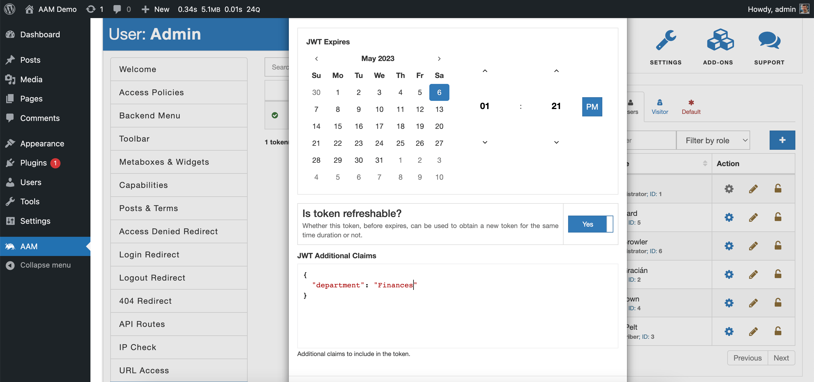
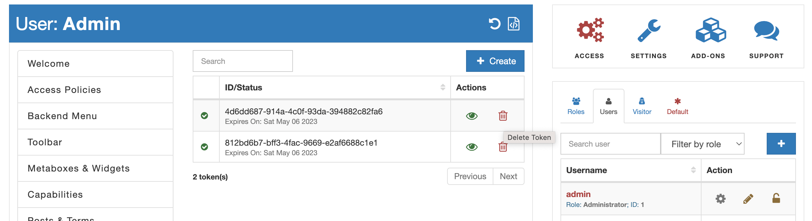

::: info Quick Facts
- **It is free**. There is no need to pay to get start using this service.
- You can issue unlimited number of JWT tokens for any user.
- You can include custom claims inside a token.
- The UI is intuitive and it is easy to manage the list of tokens.
- The service is customizable and developer-friendly.
:::

<YouTube id="vcniD14WiXY" />

With the "JWT Tokens" service, you can issue unlimited tokens for any user. The issued token can be used immediately, and you can revoke it at any time by simply deleting it from the list.

When you create a new token, you can select the expiration date-time, wether the token can be used to obtain the new one, and include any custom claims you desire.



We simplified how to refresh about-to-be-expired token by including a custom claim the `refreshable`. We believe the Auth 2.0 standard over-complicates things with the "refresh token" idea.

Here is the example of claims.

```json
{
  "iat": 1682788943,
  "iss": "https://demo.aamportal.com",
  "exp": 1683393685,
  "jti": "812bd6b7-bff3-4fac-9669-e2af6688c1e1",
  "department": "Finances",
  "refreshable": true,
  "userId": 1
}
```

You can start using the issued token immediately and, if necessary, revoke it by simply deleting it from the list.



The service is customizable and developer-friendly. You can configure how tokens are signed with [ConfigPress](/plugin/advanced-access-manager/configpress) and programmatically manage them with [RESTful API](/advanced/restful/reference/jwt) or [AAM framework](/advanced/api/service/jwt).
