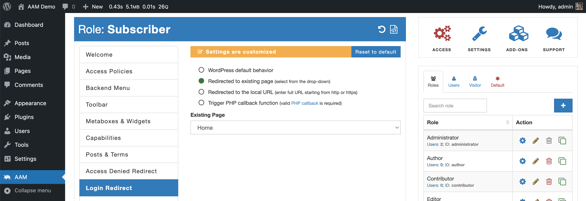

::: info Quick Facts
- **It is free**. There is no need to purchase any premium add-ons to use all the features in this service.
- You have three different options to customize user experience after they successfully log in.
- You can customize the login experience for any role or individual user.
- With the help of [Access Policies](/advanced/access-policy/param/login-redirect), the login experience can be adjusted by any number of conditions.
:::

The default login experience for WordPress is a redirect to the backend area of a website. In many cases, this is not a good user experience, especially if the user should stay only on the frontend side of a website. The Login Redirect service allows you to customize the redirect with a simple yet powerful UI interface.

Besides the default WordPress login experience, AAM offers three different redirect options.

- **Redirect to an existing page**. The option presents an additional drop-down with all the pages on the website to choose from.
- **Redirected to a URL**. Requires to provide a valid URL to redirect to. The redirect is managed by WordPress core "save redirect" which typically means the URL has to be either for the same domain or allowed domains. For details, refer to the [What is a safe redirect in WordPress?](/blog/what-is-a-safe-redirect-in-wordpress) blog.
- **Trigger a PHP callback function**. The option allows triggering a custom PHP function that handles user experience after successful authentication.