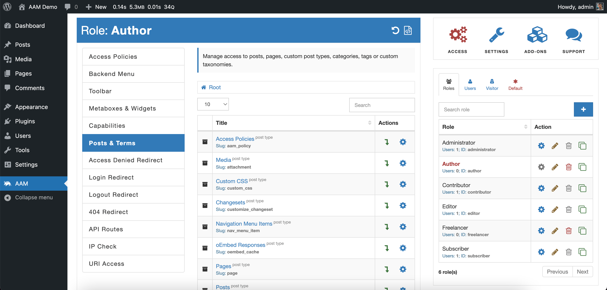

::: info Quick Facts
- The service allows defining the most granular access to your content. Not only restricted/not restricted, but also manage visibility, redirects, protection with passwords, expiration, and more.
- Define access controls to an indefinite number of posts, pages, media items, and custom post types **with a free** AAM version.
- The service has little to no implications on your website performance and has proven many times to be impeccable on large-scale websites (with hundreds of thousands of posts).
- The premium [Complete Package](/premium) allows managing access by categories and tags or defining the default access to all posts, pages, media items, custom post types, or taxonomies.
- You can define access controls for any registered [post type](https://wordpress.org/documentation/article/what-is-post-type/) on the site and with the premium [Complete Package](/premium) for any registered [taxonomy](https://developer.wordpress.org/themes/basics/categories-tags-custom-taxonomies/).
:::

The "Posts & Terms" service has all the necessary tools to define the most granular access to any WordPress website content. We carefully selected and engineered every single bit of the service based on thousands of interactions with our large user base. We are confident that if you understand the AAM fundamental concept of the [access controls inheritance](/question/aam/what-is-access-controls-inheritance), there is no limit to what you can do.

