::: info Quick Facts
- The service allows defining the most granular access to your content. Not only restricted/not restricted, but also manage visibility, redirects, protection with passwords, expiration, and more.
- Define access controls to an indefinite number of posts, pages, media items, and custom post types **with a free** AAM version.
- The service has little to no implications on your website performance and has proven many times to be impeccable on large-scale websites (with hundreds of thousands of posts).
- The premium [Complete Package](/premium) allows managing access by categories and tags or defining the default access to all posts, pages, media items, custom post types, or taxonomies.
- You can define access controls for any registered [post type](https://wordpress.org/documentation/article/what-is-post-type/) on the site and with the premium [Complete Package](/premium) for any registered [taxonomy](https://developer.wordpress.org/themes/basics/categories-tags-custom-taxonomies/).
:::

The "Posts & Terms" service has all the necessary tools to define the most granular access to any WordPress website content. We carefully selected and engineered every single bit of the service based on thousands of interactions with our large user base. We are confident that if you understand the AAM fundamental concept of the [access controls inheritance](/question/aam/what-is-access-controls-inheritance), there is no limit to what you can do.


The free AAM plugin allows defining access to individual _posts_ or any post type. With the premium [Complete Package](/premium) you can also manage access to _terms_ of any taxonomy or even set the default access controls to the entire post type. With a carefully thought-through access strategy, you have no limits to what you can do with this service.

When you navigate to the "Posts & Terms" tab, the initial table lists all the registered post types and taxonomies. We call it the _Root_ level, and with the [Complete Package](/premium), you can define default access settings for all the _posts_ or _terms_ that belong to selected post type or taxonomy.

::: info FYI!
To learn more about WordPress content and how access controls inheritance work, refer to the [How is WordPress content organized?](/question/content-access/wordpress-content-organization) Q&A.
:::

When you drill-down to any post type or taxonomy, you should see the list of all _posts_ and _terms_ associated with selected entity. Further we list all access controls you can setup for _posts_ and _terms_.

### Post Access Controls

The unique characteristic of AAM is that it allows defining the most granular access to the content. It is not just allowed or denied. It is close to 20 different ways to specify how content should be limited and what is the user's experience.

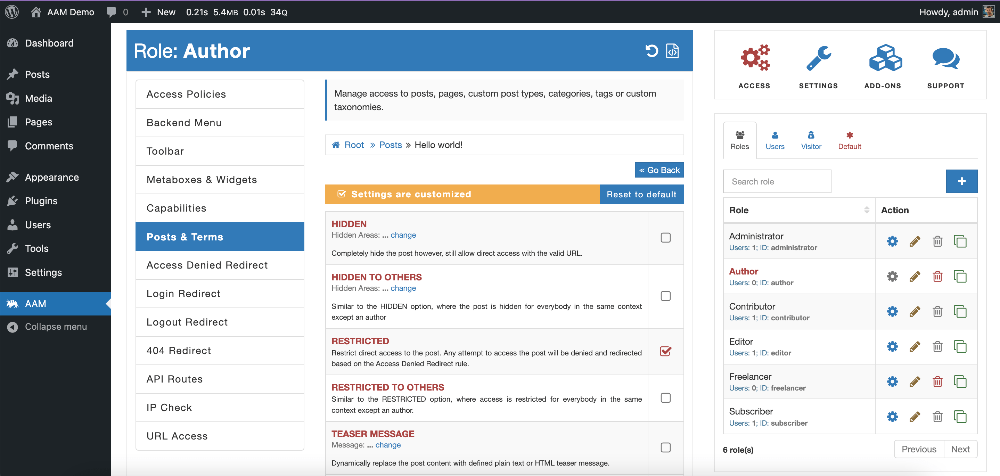

#### HIDDEN

Hide a _post_ on the _frontend_, _backend_, and RESTful API levels. AAM filters out the selected _post_ from all menus or lists. However, the _post_ can be accessed with a direct URL.

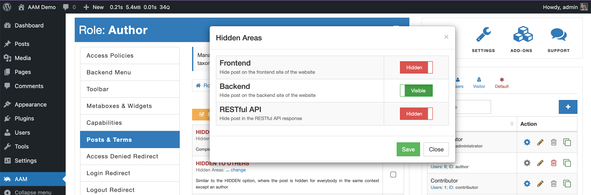

#### HIDDEN TO OTHERS

Similarly to [HIDDEN](/plugin/advanced-access-manager/service/post-term#hidden) option, manage a _post_ visibility to a user with the same role as the post author. However, if the settings are applied to everybody (available only with the premium [Complete Package](/premium)), then it truly allows showing the post only for the author.

#### RESTRICTED

Manage the ability to read or directly access a _post_. However, note that this does not hide the _post_ link in the search results, list of posts, menu, etc. To hide the _post_, use the [HIDDEN](/plugin/advanced-access-manager/service/post-term#hidden) option as well.

#### RESTRICTED TO OTHERS

Similarly to the [RESTRICTED](/plugin/advanced-access-manager/service/post-term#restricted) option, managing the ability to read or directly access a _post_ by a user with the same role as the post author. However, if the settings are applied to everybody (available only with the premium [Complete Package](/premium)), then it truly allows accessing the _post_ only for the author.

#### TEASER MESSAGE

Limit access to read a _post_ by showing a custom teaser message. It is helpful to use this option when there is a need to prompt a user to do some action like log in or renew a subscription plan.

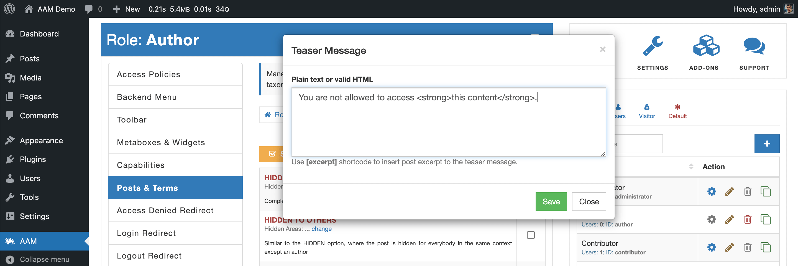

::: info FYI!
The teaser message can be plain text or rich HTML with embedded [shortcodes](https://codex.wordpress.org/Shortcode). AAM also supports a custom `[excerpt]` shortcode that injects a post's excerpt if available.

```html
<div class="text-center">
	
	<h2>Access Denied</h2>
	<p class="text-muted">Please contact our system administrator for more information</p>
</div>
```

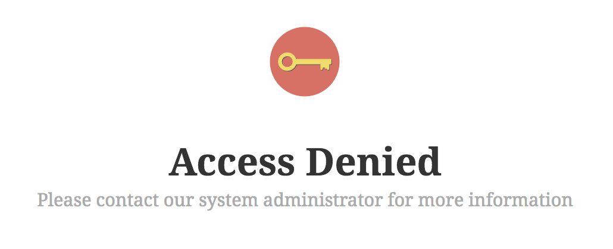
:::

#### LIMITED

Define how many times a _post_ can be opened for reading or download. This option is available only for authenticated users as there is no secure way to track visitors’ activity.

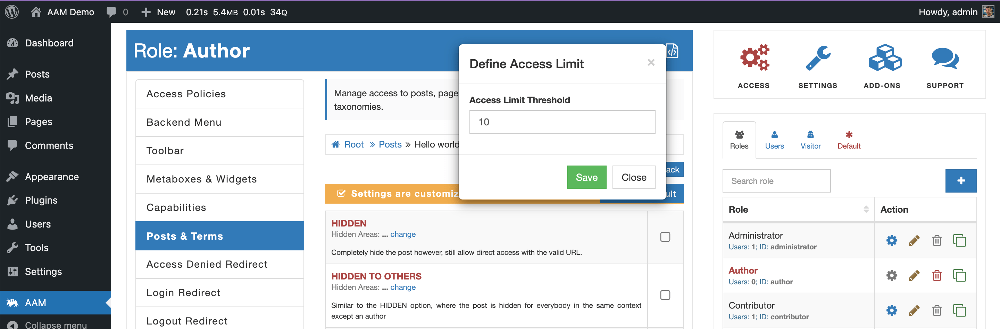

Some plugins track visitors’ activity with cookies, browser local or session storages, or even through IP. All these methods have limitations and cannot be used to reliably identify visitors. That is why the LIMITED option is not available for visitors.

After the user reaches the defined threshold, access to a post is denied.

#### LEAVE COMMENTS

Manage the ability to leave comments. It is very similar to how you manage commenting for any selected post.

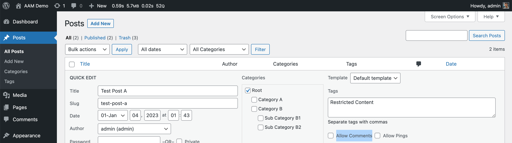

The fundamental difference is that with AAM, you can disable commenting on a group of _posts_ or even set the default access to all with the premium [Complete Package](/premium)

#### REDIRECT

Define a custom redirect when a user tries to access a _post_.

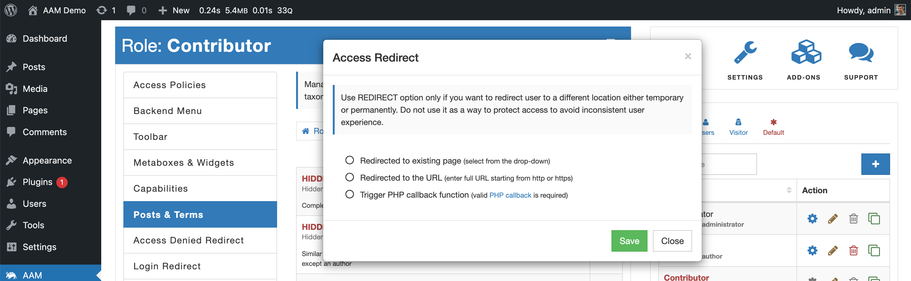

This feature allows redirecting a user to an existing page, a valid and safe URL, or triggering a custom callback function (if you need to take complete control over the redirect).

::: info FYI!
AAM performs a safe redirect with the WordPress core function [wp_safe_redirect](https://developer.wordpress.org/reference/functions/wp_safe_redirect/), which checks if the URL is for the allowed host.
:::

#### PASSWORD PROTECTED

Password protected a _post_.

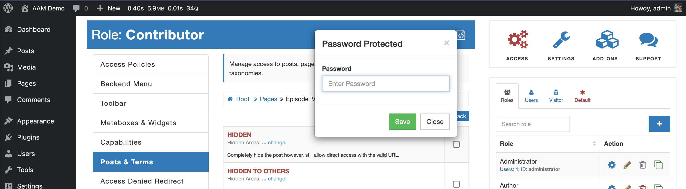

::: info Note!
Most well-designed themes support password-protected posts. However, we've seen themes that do not have this functionality coded. If you have challenges configuring this feature, confirm with the theme developer that password-protected functionality is available prior to contact us.
:::

#### ACCESS EXPIRED

Define when access to a _post_ expires. After the specified date and time, access to the _post_ is denied. The user is redirected based on the [Access Denied Redirect](/plugin/advanced-access-manager/service/access-deny-redirect) rule.

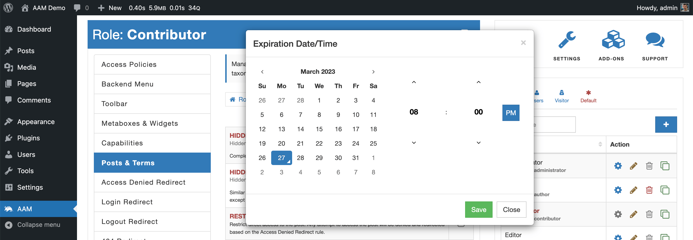

#### EDIT

Manage the ability to edit a _post_. If denied, the user will not be able to make changes to the _post_ through the _backend_ or RESTful API.

#### EDIT BY OTHERS

Similarly to the [EDIT](/plugin/advanced-access-manager/service/post-term#edit) option, managing the ability to edit a _post_ by a user with the same role as the _post_ author. This option is available with the premium [Complete Package](/premium)) only.

#### DELETE

Manage the ability to delete a _post_. If denied, the user will not be able to trash or delete the _post_ through the _backend_ or RESTful API.

#### DELETE BY OTHERS

Similarly to the [DELETE](/plugin/advanced-access-manager/service/post-term#delete) option, managing the ability to trash or delete a _post_ by a user with the same role as the _post_ author. This option is available with the premium [Complete Package](/premium)) only.

#### PUBLISH

Manage the ability to publish a draft _post_.

#### PUBLISH BY OTHERS

Similarly to the [PUBLISH](/plugin/advanced-access-manager/service/post-term#publish) option, managing the ability to publish a draft _post_ by a user with the same role as the _post_ author. This option is available with the premium [Complete Package](/premium)) only.

#### REFERENCE CHECK

Manage access to a _post_ based on a user's reference attributes like IP address, geographical location, referred domain, or URL query parameters.

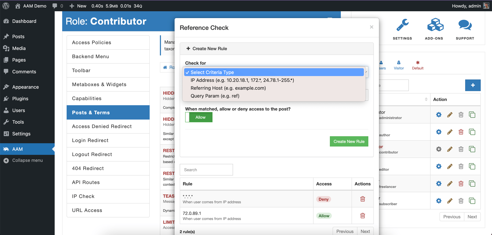

This option is available only with the [Complete Package](/premium) add-on, and you can learn more about the way it works [here](/plugin/premium-complete-package/reference-based-access/manage-access-to-content).

### Term Access Controls

AAM allows managing access controls to any individual _term_ with the premium [Complete Package](/premium) add-on. It supports several most common options as listed below.

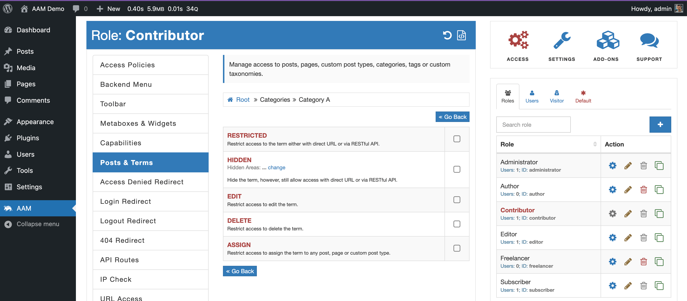


#### RESTRICTED

Manage the ability to browse a _term_ directly. In other words - see the list of _posts_ that belong to the _term_. For example, you can use _terms_ to organize content on the _frontend_ where a user can navigate to a link like `/category/science` and see all pages tagged with the "Science" category. The "RESTRICTED" option denies access to these types of links.

#### HIDDEN

Manage _term’s_ visibility. In other words - hide the _term_ however, allow direct access with URL. You can manage the _term's_ visibility separately for the _backend_, _frontend_, and RESTful API levels.

#### EDIT

Manage the ability to edit a _term_.

#### DELETE

Manage the ability to delete a _term_.

#### ASSIGN

Manage the ability to assign a _term_ to _posts_. It is a helpful constraint if you do not want your users to assign _posts_ to any specific categories.