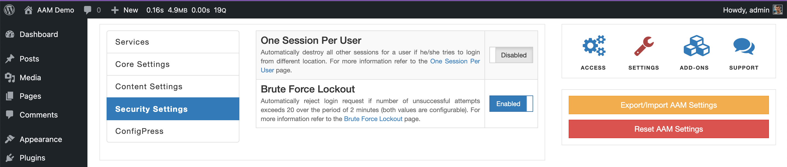
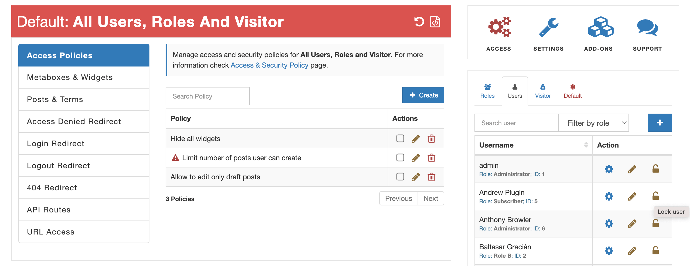
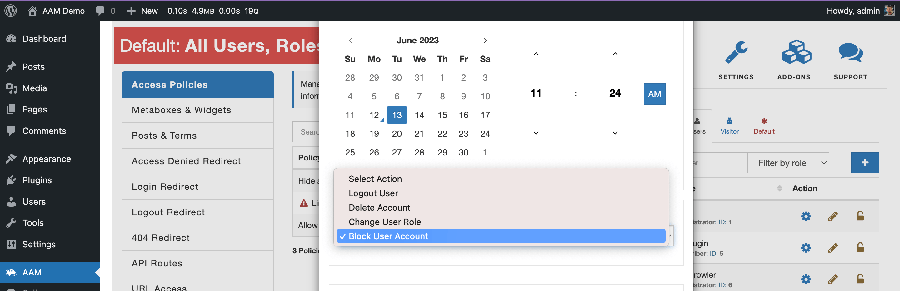

::: info Quick Facts
- The service enhances the WordPress authentication (login) process with brute-force protection and single-user session features.
- The service has a new frontend login widget for classical themes (not block-based themes).
- The service provides the ability to block (lock users from being able to log in) users immediately or after a defined time in the future.
:::

The "Secure Login" service does not have a dedicated tab on the UI like [Posts & Terms](/plugin/advanced-access-manager/service/post-term) or [Backend Menu](/plugin/advanced-access-manager/service/backend-menu). However, upon enabling, you may notice some minor changes to the UI as follows.

### Security settings

The "Security Settings" tab has just two features. However these are the most asked features, so we decided to start from them.

Both features are well-documented and you can find additional details by following the links below.
[Brute Force Lockout](/plugin/advanced-access-manager/setting/bruteforce-lockout).
[One Session Per User](/plugin/advanced-access-manager/setting/one-session-per-user)

### Block user

The block user feature is a great option when you need to either temporarily or permanently deny the ability to login to the website, however, you need to keep all user's data.

When the "Secure Login" service is enabled, the additional action "Block" becomes available on the [Users & Roles widget](/plugin/advanced-access-manager/ui-overview#access-page).

Additionally, you can block user access to the website [after their access expires](/question/authentication/temporary-account).

### Configuration

The service is configurable and a few options are available for [ConfigPress](/plugin/advanced-access-manager/configpress/).

- [service.secure_login.login_attempts](/plugin/advanced-access-manager/configpress/service-securelogin-login-attemtps) to define how many times a user can try to login before temporarily locking further attempts.
- [service.secure_login.time_window](/plugin/advanced-access-manager/configpress/service-securelogin-time-window) to define the login time window.
- [service.secure_login.login_message](/plugin/advanced-access-manager/configpress/service.secure-login.login-message) to redefine the default "access denied" message on the login screen.