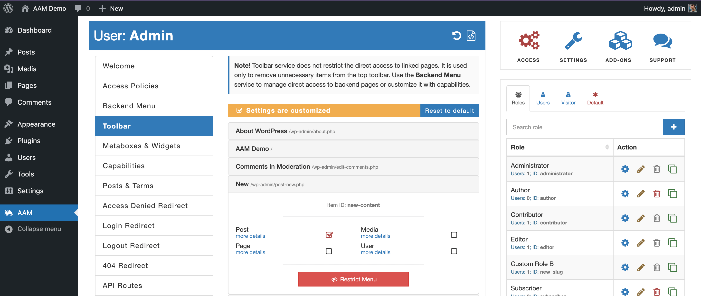

The admin toolbar (aka toolbar, backend toolbar) is the top bar rendered on the _backend_ side of the website and sometimes on the _frontend_ (depending on the theme or website settings). It contains a collection of shortcuts to the backend pages.

::: info Note!
The Toolbar service does not restrict direct access to linked pages. It is used only to remove unnecessary items from the top admin toolbar. Use the [Backend Menu](/plugin/advanced-access-manager/service/backend-menu) service to manage direct access to backend pages or customize it with [capabilities](/plugin/advanced-access-manager/service/capability).
:::

If you are looking to completely hide the toolbar on the _frontend_ for any roles or individual users, you can create a custom capability [aam_show_toolbar](/plugin/advanced-access-manager/capability/aam_show_toolbar) and make sure that it is not checked for desired role or user.