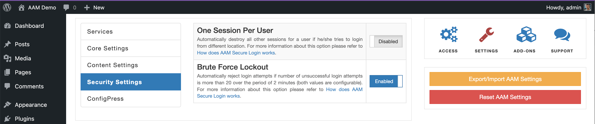

By enabling the _Brute Force Lockout_ option, AAM will count the number of login attempts per IP address. If there are 20 failed consequent attempts, AAM does not allow further login requests for the next 20 minutes.

The number of attempts and pausing timeframe are configurable with  ConfigPress as follows.

```ini
[aam]
; Set number of login attempts
service.secureLogin.settings.loginAttempts = 20
; Set login lockout time. Any valid Date Time Format.
service.secureLogin.settings.attemptWindow = "20 minutes"
```

::: info FYI!
Under the hood, the brute force lockdown feature uses the [WordPress transients](https://developer.wordpress.org/apis/transients/) to temporarily store counters in the DB. It is a very primitive, yet, effective functionality. However, if your website is the subject of constant attacks, we strongly advise using a hosting provider that offers a WAF (Web Application Firewall) layer that sits in front of your WordPress website instance or your load balancer.
:::