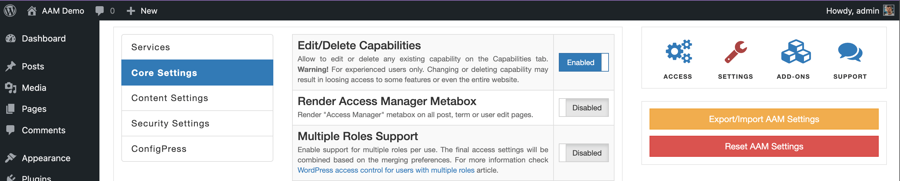
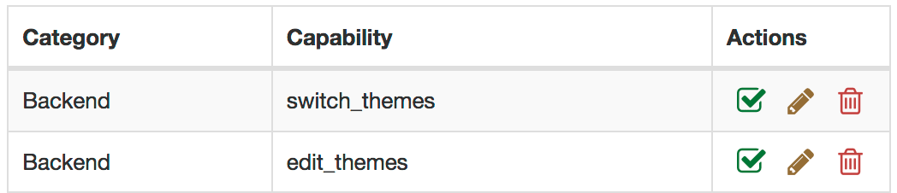

An ability to edit or delete any capability is disabled to prevent unforced mistakes unless explicitly enabled. However, when enabled, the two additional icons are available for use - the _Edit_ and the _Delete_.

::: danger Warning!
It is crucial to understand that changing or deleting any capability may cause your website to malfunction.
:::

The best practice is to have only one administrator user on your website that has full access to manage all aspects of the website. If, for any valid reasons, you need to grant access to other privileged users to the [Capabilities](/plugin/advanced-access-manager/service/capability) service, then consider drawing boundaries and protect critical capabilities from accidental deletion or modification with [access policies](/advanced/access-policy/). You can leverage the [Capability](/advanced/access-policy/resource-action/capability) resource for this.