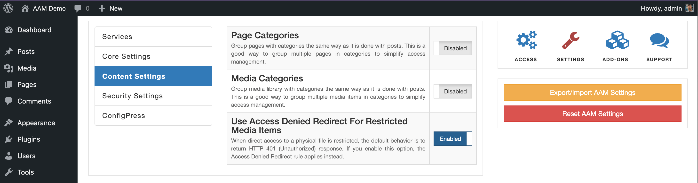

Apply the redirect rule configured with the [Access Denied Redirect](/plugin/advanced-access-manager/service/access-deny-redirect) service when an unauthenticated user tries to access the protected file directly.

The default behavior is to throw the `HTTP 401 (Unauthorized)` response. In most scenarios, this is expected. However, depending on your desired UX (user experience), this may not provide enough clarity to the end user.

For more detail, refer to the [Access denied redirect](/plugin/protected-media-files/access-denied-redirect) article for the media items.