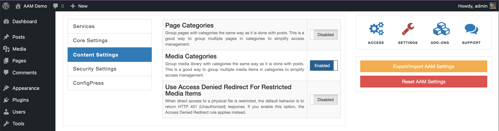
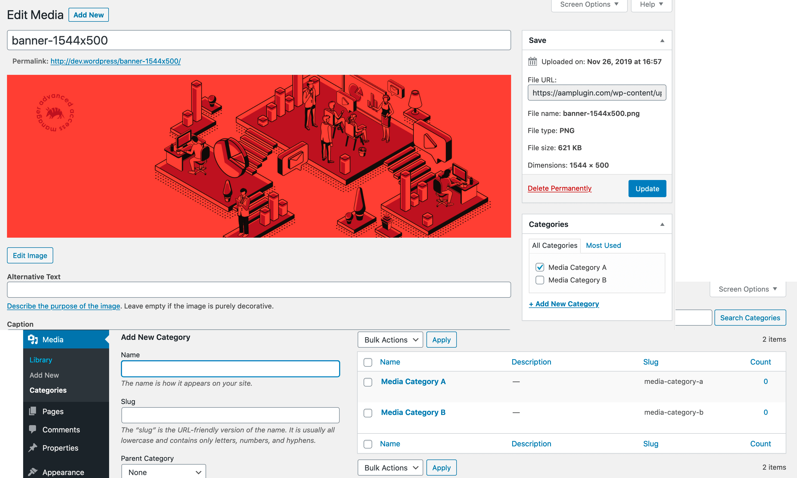

::: info FYI!
This functionality is available with the premium [Complete Package](/premium) add-on.
:::

A basic WordPress setup does not allow grouping media items into categories. It can be handy when you plan to manage access to a group of media assets. Upon enabling the _Media Categories_ setting, you may start creating and grouping your media items into categories the same way as with regular posts.

::: info FYI!
For more information on how this setting helps to streamline your access controls, check the [Manage bulk access](/plugin/protected-media-files/bulk-access) page.
:::