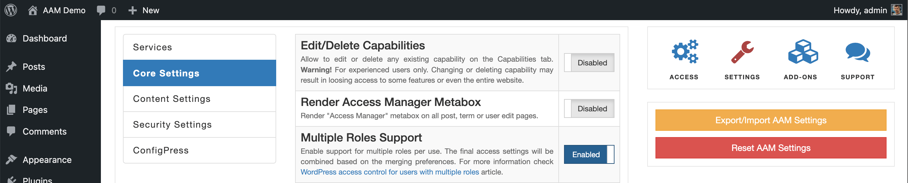

Allow assigning multiple roles to a user. By enabling this setting, AAM replaces the default WordPress core _User Roles_ drop-down and renders the multi-select component.

::: info Note!
It is important to emphasize that assigning multiple roles to a single user introduces complexity due to the possible access settings ambiguity. For example, you have Lesley, who has both Editor and Contributor roles. You defined access controls where all editors can manage all pages. However, contributors can manage only pages in the "News" category. In this case, does Lesley have access to the "News" category or not? Depending on the company's policy and access strategy both yes and no answers are correct.

For more detail, refer to the [How to work with settings ambiguity?](/question/aam/access-controls-ambiguity) Q&A.
:::