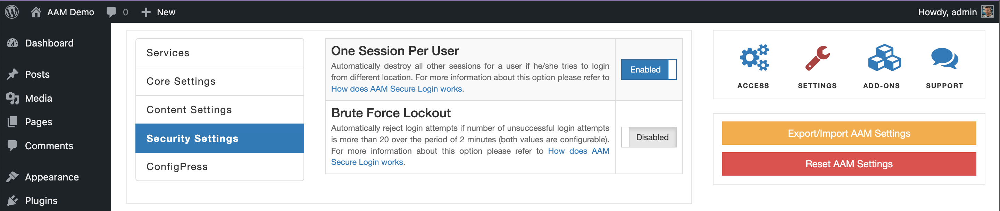

Manage the number of active sessions per user and automatically terminate all other active sessions if the same user logs in from a different location or device.

::: info FYI!
AAM uses WordPress core functionality to determine the current number of active user sessions. For a technical explanation of how this works, refer to the [WP_Session_Tokens](https://developer.wordpress.org/reference/classes/wp_session_tokens/) documentation.
:::