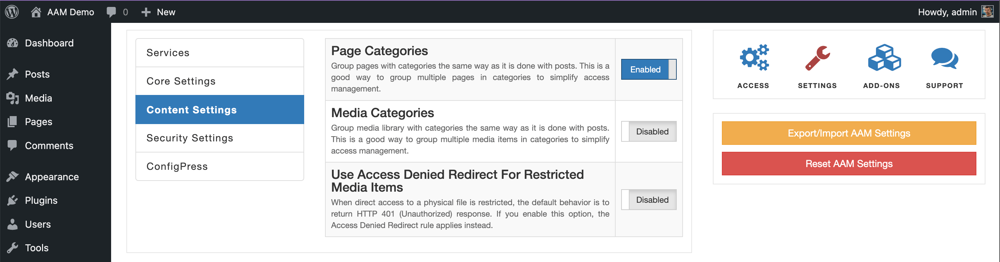

::: info FYI!
This functionality is available with the premium [Complete Package](/premium) add-on.
:::

Allow grouping of the regular WordPress pages into categories. If enabled, you can start creating custom categories for pages and manage access to the group of pages through these categories.