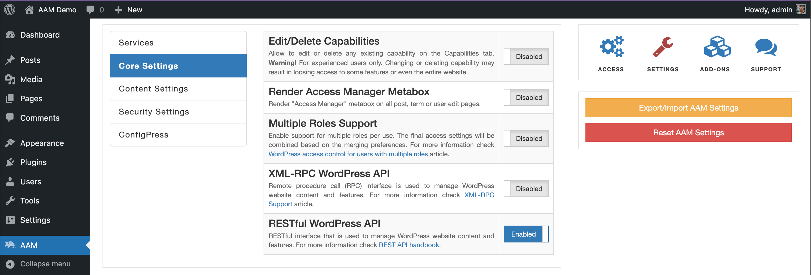

::: danger Warning!
WordPress 5.0 or higher and Gutenberg editor requires that the RESTful API is enabled at all times. Otherwise you will be not able to edit your website content. AAM 6.9.6 also requires the RESTful API to support its UI functionality.
:::

Manage the RESTful API accessibility.