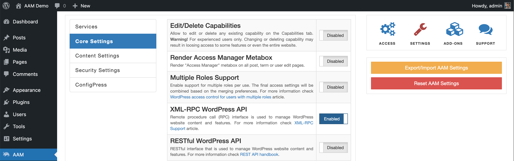

XML-RPC API is the WordPress core feature. It allows other applications programmatically manage the WordPress website content. The complete list of available actions is listed in [the official WordPress codex](https://codex.wordpress.org/XML-RPC_WordPress_API).

You can disable the XML-RPC API with this setting. We recommend disabling the XML-RPC API unless you are absolutely sure it is used.

::: info FYI!
The XML-RPC API is a legacy integration path. The modern way to programmatically work with WordPress features is through RESTful API.
:::