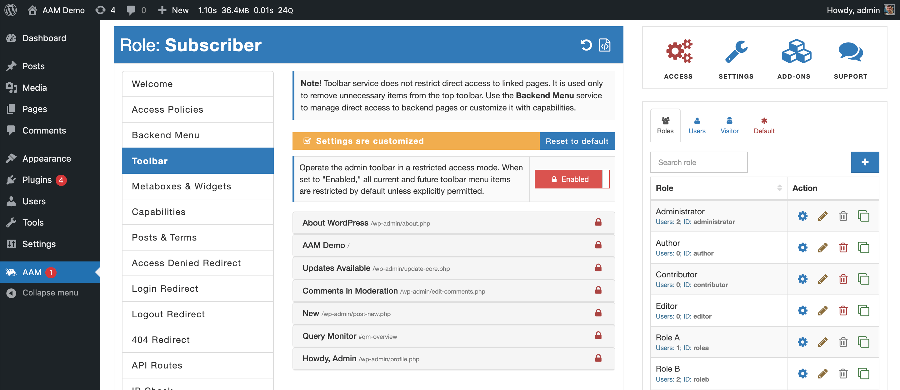

Many WordPress plugins and themes register various admin toolbar menu items that may not be relevant or needed by certain users on your website.

You can filter out unnecessary items with [Toolbar](/plugin/advanced-access-manager/service/toolbar) service. However, there is one issue - when you activate new plugins or change a theme, additional toolbar menu items may appear and you would have to go and hide them again. This is also true for already active plugins or a theme that may introduce new toolbar items with an update.

The admin toolbar restricted mode hides all the menu items by default and only shows those that you explicitly allowed.

