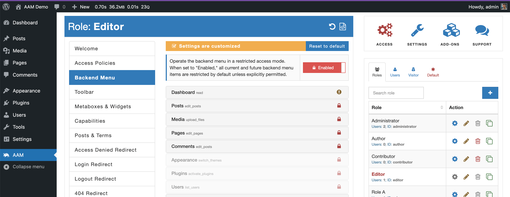

You may already know that access to the WordPress backend is managed through roles and capabilities. However, many WordPress plugins and themes reuse core capabilities to control access to their functionality. It potentially creates undesirable behavior where even users with the lowest "Subscriber" role have access to information they are not allowed to see. Things get progressively worse for higher-level roles.

By enabling the restricted mode, all backend menu items become inaccessible unless explicitly allowed. It mitigates the following risks:
- Prevent from gaining access to existing plugins' or theme's functionality users should not have access to.
- Prevent access to functionality that is introduced with new plugins' or theme updates.
- Prevent access to functionality that is introduced by new plugins or new themes.
- Prevents access to unwanted backend menu items when the commonly re-used capability is granted (e.g. `manage_options` or `edit_pages`).
