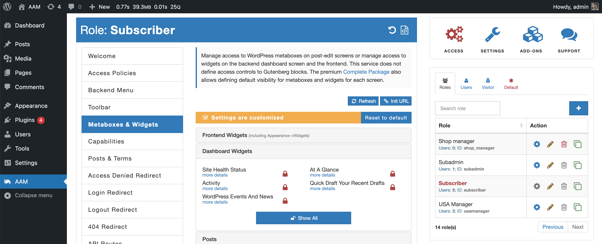

Many WordPress plugins and themes register various metaboxes and widgets (both frontend and backend) that may not be relevant or needed by certain users on your website.

You can filter out unnecessary components with [Metaboxes & Widgets](/plugin/advanced-access-manager/service/metabox-widget) service. However, there is one issue - when you activate new plugins or change a theme, additional components may appear and you would have to go and hide them again. This is also true for already active plugins or a theme that may introduce new components with an update.

The components-restricted mode hides all the metaboxes or widgets by default and only shows those that you explicitly allowed on each screen.

