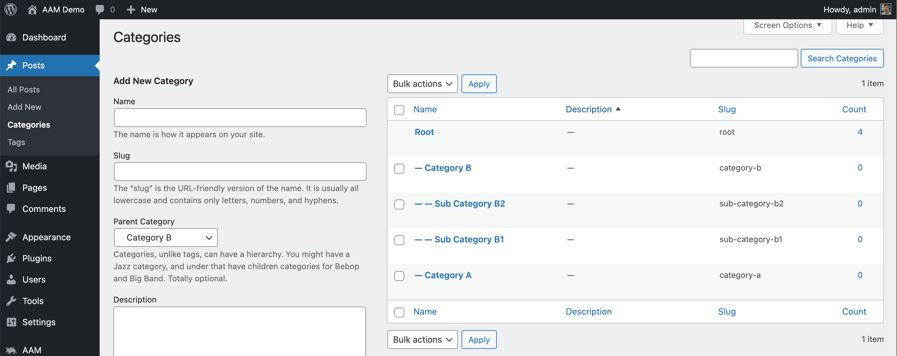
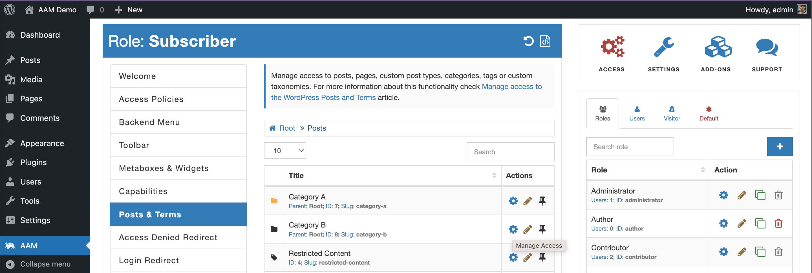
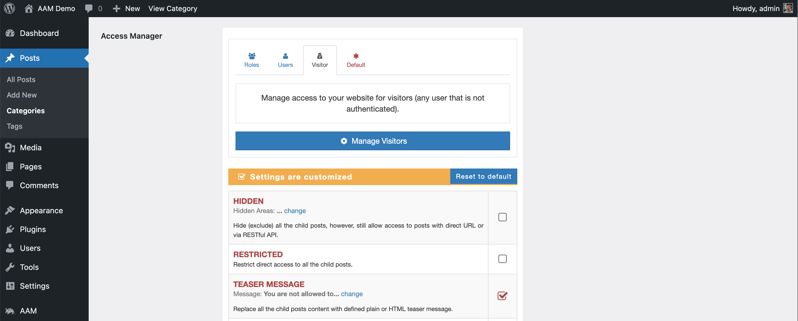
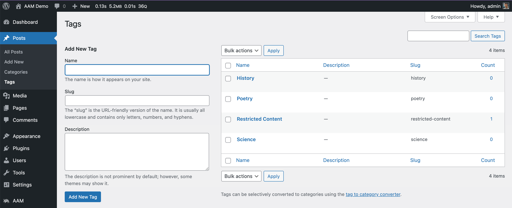

There are two distinct taxonomy groups that WordPress core support - hierarchical taxonomies (aka "categories") and non-hierarchical (aka "tags"). The perfect example of such are regular WordPress post categories and post tags. The Complete Package add-on allows managing access to all taxonomies, terms, and _posts_ that belong to them.

::: info FYI!
We recommend checking the [How is WordPress content organized?](/question/content-access/wordpress-content-organization) Q&A to better understand the difference between _terms_ and _taxonomies_. It also helps to learn more about how WordPress core structures content and how the access controls inheritance mechanism works.
:::

Remaining of this article describes how to manage access to _posts_ that belong to categories and tags.

### Categories access

First, let's define what _category_ means because there are many definitions online, and all of them are correct in one way or another.

We try to keep everything simple and straight to the point, so in our mind, the _category_ is a type of taxonomy that allows the creation of a hierarchy of terms where each child term can have **only one** parent. The perfect example of a hierarchical taxonomy is the "Post Categories".

::: info FYI!
The technical definition of the "Post Category" or "Category" is - _the term of the `category` taxonomy_.
:::

Typically we (WordPress users) create _terms_ to group one or more _posts_. In other words, we organize our _posts_ by grouping them with _terms_. So it is natural to want to have the ability to manage access to these groups and expect that all belonging _posts_ inherit these controls. It is where the premium Complete Package brings power.

You can manage access to both custom and WordPress core hierarchical taxonomies on the AAM page with the [Posts & Terms](/plugin/advanced-access-manager/service/post-term) service.

As an option, you also can manage access to them directly on the _Edit Term_ page (if the [Render Access Manager Metabox](/plugin/advanced-access-manager/setting/render-access-metabox) is enabled).

### Tags access

Similarly to the _categories_, the Complete Package allows managing access to _tags_. The conceptual difference between categories and tags is that the second is a non-hierarchical taxonomy. Which means - it cannot have a parent term. However, under the hood, both taxonomy groups are stored in the database identically and can be reclassified in the code at any time.

### Access policies

Another way to manage access controls to terms is through the [access policies](/advanced/access-policy/) and the premium add-on extends its functionality with [additional resources](/plugin/premium-complete-package/content-access/access-policy-resources).