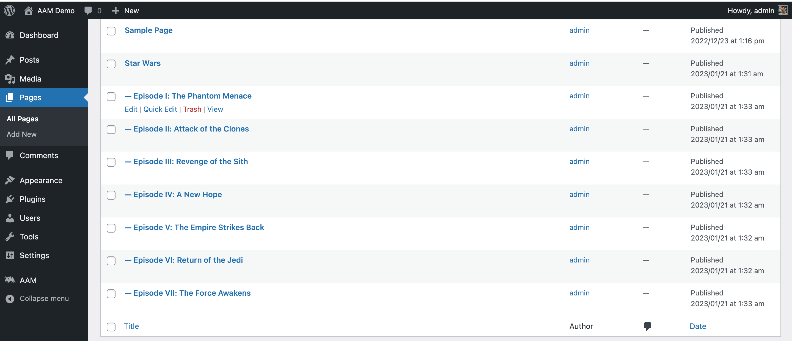
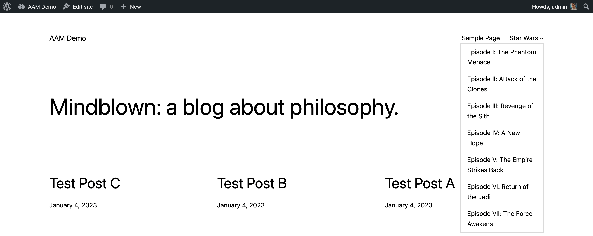
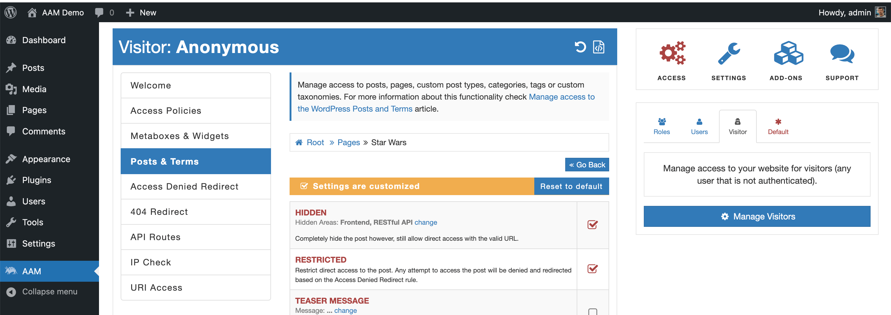

::: info FYI!
In this article, we use the term `page` and `hierarchical post type` interchangeably. Essentially WordPress classical pages are registered as hierarchical post types.
:::

## Introduction

Managing access to pages and their sub-pages is a trivial task because the premium add-on extends the access settings inheritance mechanism, and if a [post type is hierarchical](https://developer.wordpress.org/reference/functions/register_post_type/#hierarchical),  the settings will be propagated from a parent page to its sub-pages on any depth.

<YouTube id="eMenfXVcUuI" />

## Common use case

Let's assume that you need to protect the entire branch of pages and hide them for all visitors. You also need to restrict these pages for direct access (if, by any chance, an anonymous user has a direct URL to the protected page).

In this example, I've created the page "Star Wars" and several sub-pages. These pages are nicely organized on the frontend side as part of the main menu. So your objective is to hide the entire branch or pages from visitors.

## Implementation

The process is straightforward. Navigate to the AAM page and switch to manage visitors on [the Users & Roles widget](/plugin/advanced-access-manager/ui-overview#access-page).

The next step is to select the _Posts & Terms_ tab and drill down to the _Pages_. You should be able to find the correct page and manage its access. In my case, I've selected the "Star Wars" page and made it hidden and restricted.

From this point on, all sub-pages inherit these access settings from their parent page. You can have an unlimited number of nested pages.

