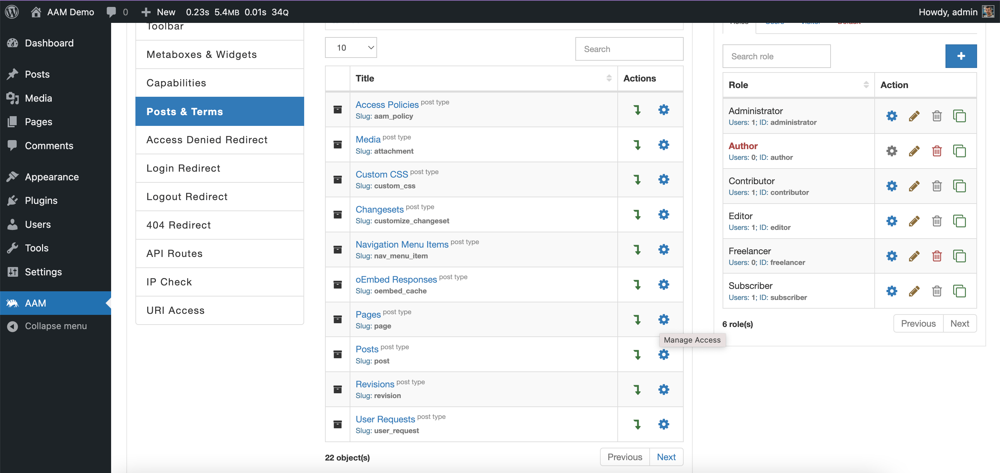
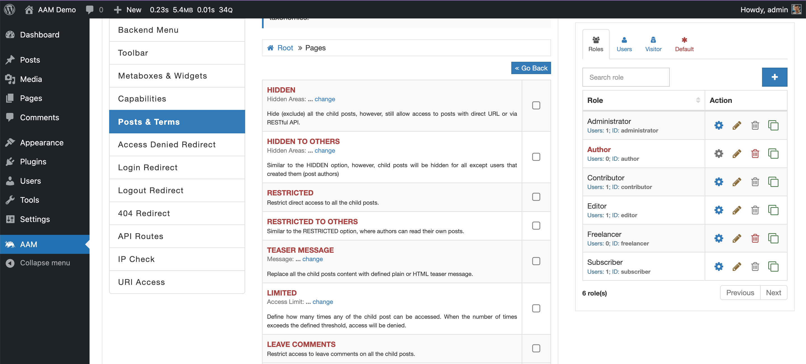

It is a common requirement to have the ability to define the default access controls to all _posts_ of any specific post type. For example, you may want to restrict reading all pages to visitors or not allow editing of all posts to everybody except administrators.

On the [Posts & Terms](/plugin/advanced-access-manager/service/post-term) tab, you can find the list of all registered post types and taxonomies on your website. It is the place where you can choose to set the default access by selecting the blue gear button next to the desired post type.

::: info Note!
Look closely for the post type _Slug_ as it accurately represents the post type. There can be many custom post types with the same name (for example, "Posts"), so it is easy to make mistakes and set default access controls to the wrong type.
:::

After defining the default access controls, you can always override them for any individual _post_ or _term_ by drilling down to the post type.

Another way to manage access controls to post types is through the [access policies](/advanced/access-policy/) and the premium add-on extends its functionality with [additional resources](/plugin/premium-complete-package/content-access/access-policy-resources).