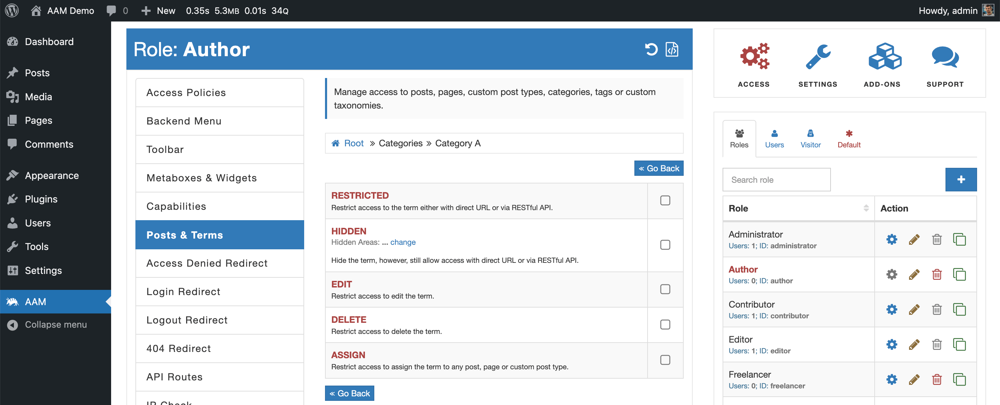

On the [Manage access to categories and tags](/plugin/premium-complete-package/content-access/manage-access-to-categories-and-tags), we briefly discussed how to manage access to all _posts_ labeled (grouped, categories, or tagged) by terms. Here, we emphasize that you can define access to the _term_ itself. You can also target the entire _taxonomy_ so that all the child terms can inherit defined access settings.

::: info FYI!
We recommend checking the [How is WordPress content organized?](/question/content-access/wordpress-content-organization) Q&A to better understand the difference between terms and taxonomies. It also helps to learn more about how WordPress core structures content and how the access controls inheritance mechanism works.
:::

This feature is helpful when you need to protect how _terms_ are managed or displayed. For example, you may want to restrict the ability to edit and delete categories by everybody except administrators. Or you may need to hide certain tags on the _frontend_ for all visitors.

It is essential to understand that these access settings affect **only** _terms_ themself and have no impact on _posts_ that belong to them. If you need to manage access to posts that belong to certain terms, refer to the [Manage access to categories and tags](/plugin/premium-complete-package/content-access/manage-access-to-categories-and-tags) page.

Another way to manage access controls to terms is through the [access policies](/advanced/access-policy/) and the premium add-on extends its functionality with [additional resources](/plugin/premium-complete-package/content-access/access-policy-resources).