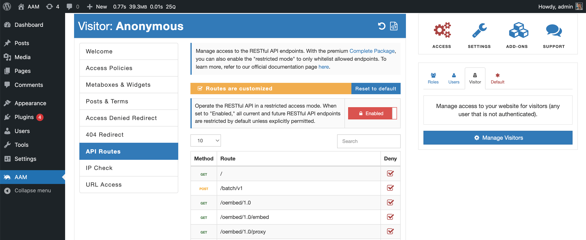

Define the default access to all RESTful API endpoints and restrict them unless explicitly allowed.

Many modern WordPress plugins and themes register custom RESTful API endpoints that are easily discoverable through the `/wp-json/` URI. Some endpoints may not adhere to the WordPress security best practices which may lead to a compromised website.

To mitigate this attack vector, AAM gives you the ability to enable restricted mode for the entire RESTful API and only allows endpoints that are absolutely needed.

