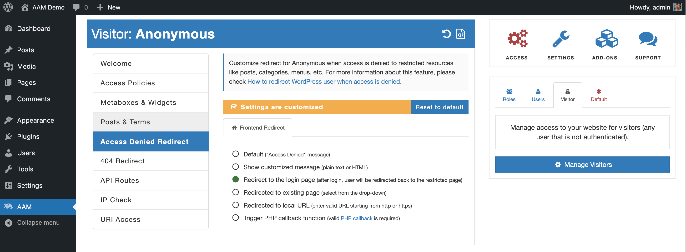
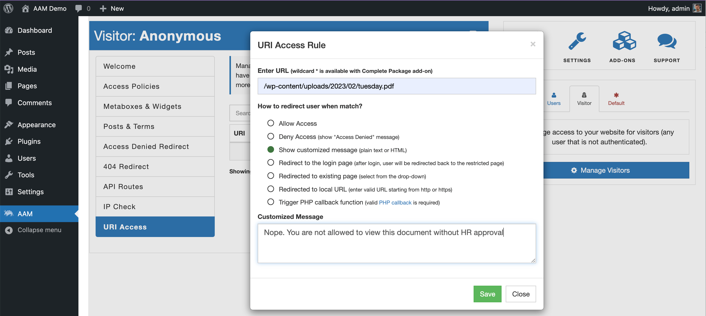

The default workflow, when a user tries to open the restricted file, is to respond with [HTTP 401 (Unauthorized)](https://developer.mozilla.org/en-US/docs/Web/HTTP/Status/401). Depending on the browser, it shows an empty screen or "This page isn't working...". It may not be the best user experience if you want to explain to the user the reason they can't access the file.

You can customize the user experience in a few different ways, and it depends on the service you use to restrict access to files ([Posts & Terms](/plugin/advanced-access-manager/service/post-term) or [URL Access](/plugin/advanced-access-manager/service/url-access)).

## Posts & Terms redirect

When you restrict access to media items with the _Posts & Terms_ service, the access denied redirect can be configured with the [Access Denied Redirect](/plugin/advanced-access-manager/service/access-deny-redirect) service. The only step that you need to take is to enable the [Use Access Denied Redirect For Restricted Media Items](/plugin/advanced-access-manager/setting/media-access-denied-redirect) option on the AAM _Settings_ page. This way, if an unauthorized identity tries to access a protected file with a direct URL, the configured access denied rule triggers.

::: info FYI!
It may appear confusing why you need to enable the _Use Access Denied Redirect For Restricted Media Items_ when you manage access to media items with the _Posts & Terms_ service. The main reason for this extra hoop is because the _Posts & Terms_ service primarily manages access to the WordPress _posts_. Media items are tricky because they consist of two parts - a `post` (record in DB) and a physical file. You can learn more about it on the [Things to know](/plugin/protected-media-files/things-to-know#about-media-items) page.
:::

## URI Access redirect

The [URL Access](/plugin/advanced-access-manager/service/url-access) service is designed to manage access to parts of your website that may not directly tight to the WordPress website. For example, you may choose to upload some stand-alone files directly to the `/wp-content/uploads` directory. This is where the _URI Access_ service can help you define your access controls.

::: info Note!
The URI access rule has higher precedence than the Posts & Terms settings. If you restrict access to a media item with the _Posts & Terms_ service and restrict the same file with the _URI Access_ service, the second takes effect.
:::