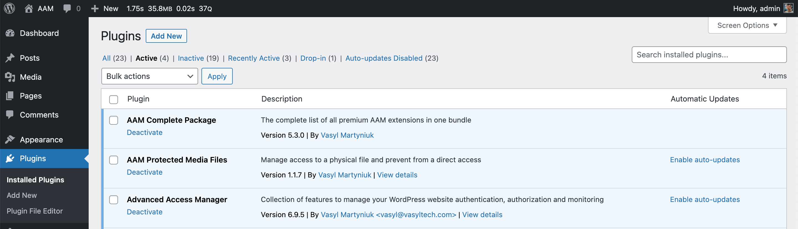
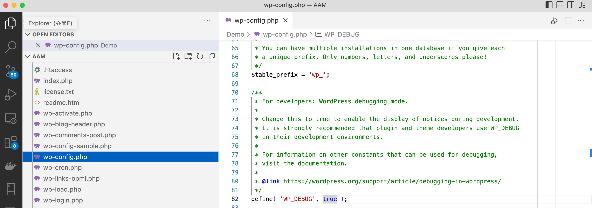
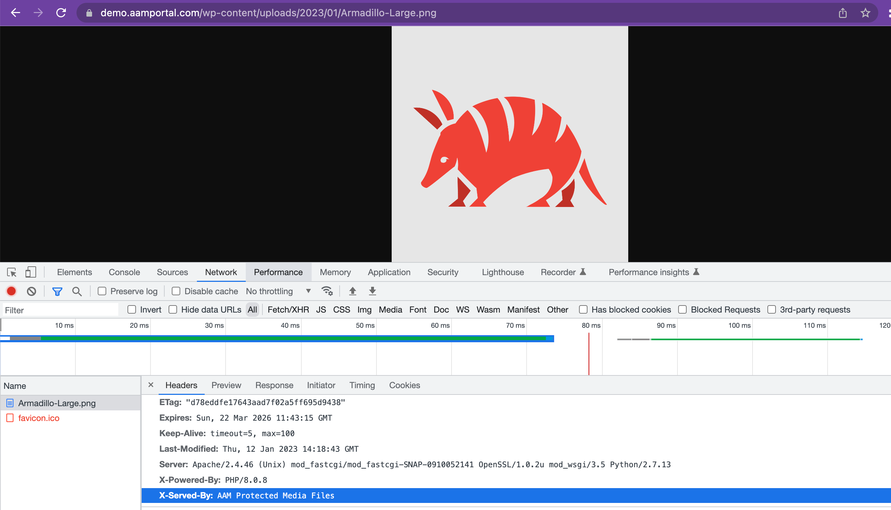

::: info Note!
If you do not consider yourself a tech-savvy person, please do not get intimidated by the snippets of the code and screenshots in this section. Just follow the instructions and stay cool. You are just 30 minutes away from accomplishing your objectives. So don't give up.
:::

It is important to follow **all the installation steps** as outlined in this section. We've done our best to explain in greater detail every single step and why it is required. Please take your time to read it all through and truly understand what you are doing.

Please also note that the material below focuses on defining access controls to files that are located in the `/wp-content/uploads` directory. However, with the same approach, you can set up any directory on your server.

## Activate the plugin

We already mentioned in the [introduction](/plugin/protected-media-files/) section, the "AAM Protected Media Files" is the add-on to the free [Advanced Access Manager](https://wordpress.org/plugins/advanced-access-manager/) plugin. Please make sure that you have both plugins downloaded and activated on your WordPress websites.

Verify that **both plugins are active** on the _Plugins_ page.



## Setup server redirect rules

This step is crucial as it configures your server (that owns all your website files) to redirect direct access to physical files to the AAM access handler. It is required to set up the redirect correctly. Without it, nothing else really matters.

::: info Why does redirect matter?
All files in your website root directory (aka folder), and all sub-directories, can be directly accessed with a URL. For example, file `/wp-content/uploads/logo.png` can be seen by typing the URL `https://yourdomain.com/wp-content/uploads/logo.png`.

The only way to protect your physical files from direct access is to set up redirect rules that signal your server to route all requests to physical files to a special program that checks if the current requester has access to a file.
:::

Below we focus on the two most popular server engines - Apache and Nginx. If your website runs on a different server, you might want to consult with your hosting provider on how to set up redirect rules that are equivalent to those below.

### Apache
Go to the root of your website and open the `.htaccess` file. Copy & paste the following configurations at the beginning of the file.

::: warning Note!
It is very important to insert these configurations at the beginning of the `.htaccess` file to eliminate any chance for other redirect rules to suppress AAM rules that manage access to your files.
:::

```htaccess
# BEGIN AAM Media Access Control
<IfModule mod_rewrite.c>
	RewriteEngine On
	RewriteBase /
	RewriteCond %{REQUEST_FILENAME} -f
	RewriteCond %{REQUEST_URI} wp-content/uploads/(.*)$
	RewriteRule . /index.php?aam-media=1 [L]
</IfModule>
# END AAM Media Access Control
```
::: info Note!
If your website root is located in a subfolder, for example, `https://mywebsitedomain.com/wordpress`, then adjust the `RewriteBase` and `RewriteRule` rules accordingly.
```htaccess
# BEGIN AAM Media Access Control
<IfModule mod_rewrite.c>
	RewriteEngine On
	RewriteBase /wordpress
	RewriteCond %{REQUEST_FILENAME} -f
	RewriteCond %{REQUEST_URI} wp-content/uploads/(.*)$
	RewriteRule . /wordpress/index.php?aam-media=1 [L]
</IfModule>
# END AAM Media Access Control
```
:::

### Nginx

The Nginx server works in a slightly different way than Apache when it comes to redirect/rewrite configurations. While Apache dynamically checks for `.htaccess` files in each directory (folder), Nginx has a configuration file(s) that a loaded once during server startup. This is one of their main claims for being faster than the Apache server.

Depending on a hosting provider, you may or may not have the ability to manage Nginx redirect/rewrite rules. However, the principle is simple – based on the relative location of your desired folder, you need to make sure that all requests to physical files are redirected to `index.php?aam-media` access control handler.

Below is an example of configurations that are identical to the Apache configurations mentioned above. You can change them depending on your specific project needs.

```nginx
location ~* ^/wp-content/uploads/ {
	rewrite (?i)^(/wp-content/uploads/.*)$ /index.php?aam-media=$1 last;
	return 307;
}
```

## Verify file redirects

To verify that directly accessed files are served through the AAM Protected Media Files plugin, you have to make sure that the [WP debug mode](https://wordpress.org/documentation/article/debugging-in-wordpress/) is enabled.

In short, go to your website's root directory and open `wp-config.php` in an editor of your own choice. Search for the `WP_DEBUG` constant and set it to `true` (if not already set).



::: warning Important!
If this is your production server, make sure that you remember to set the `WP_DEBUG` mode back to `false`.
:::

From here, pick any file from the `/wp-content/uploads` directory (or any other directory you restrict access to) and open in your browser the "Developer Tools". Various browsers have it named differently but essentially this is a developer panel that allows you to inspect your page or HTTP requests.

If everything is set up correctly, the "Response Headers", for the requested file, should contain the `X-Served-By` header with the `AAM Protected Media Files` value.

