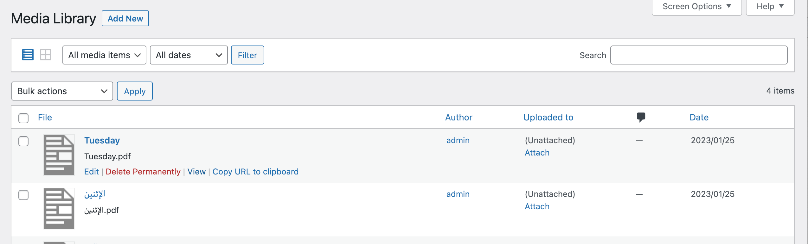

## About media items

WordPress media items, under the hood, are managed by the core as `attachment` post types. Every time you upload a new file through the _Media Library_, two things happen: a new record is created in the database table `_posts`, and the file uploads to the `/wp-content/uploads` folder. While managing access to media items, you should ensure that both DB records and physical files are protected.

It gets more complicated with images because, depending on your website setup, the WordPress core may create thumbnails of different sizes when a picture is uploaded. For example, if you upload the `armadillo.png` image through the _Media Library_, the WordPress core will also create several thumbnails (e. g. `armadillo-150x150.png`, `armadillo-300x300.png`, etc.). So, one image file instantly becomes a collection of 5 or more files on the server.

Last but not least, you have to remember that every media item has two distinct URLs. One is the permalink to the media item and another is the direct link to a physical file. That is why when you hover over any media item in the library, you notice the _View_ and _Copy URL to clickboard_ links.

Depending on your desired access strategy, various options are available to you to customize the access denied behavior. You can read more about this on the [Access denied redirect](/plugin/protected-media-files/access-denied-redirect) page.

Luckily, the AAM Protected Media Files plugin ensures that all your physical files and DB records are protected.

## About server redirects

All the website files are owned by the server. Depending on your hosting provider, it can be Apache, Nginx, IIS, etc. That is why it is a crucial step to instruct your server to redirect any direct access to your protected files to the AAM access control handler.

9 out of 10 times, the reason the plugin does not work properly is that these redirect rules are not configured properly. In the [Installation](/plugin/protected-media-files/installation#setup-server-redirect-rules) section we give our best shot to guide you through the proper setup for Apache and Nginx servers.

If you do not understand the concept of server redirects, please consult with your hosting provider support team. Any decent hosting company is more than happy to assist you with this task.