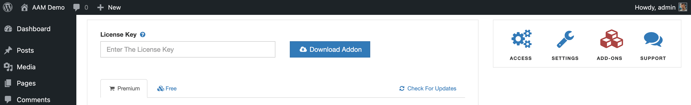

::: question Question
I've just purchased the Premium Complete Package and received the email with the license key. However, I have no idea how to install it. Can you please instruct?
:::

The [Premium Complete Package](/premium) is a regular WordPress plugin. You can download it from your license page or your WordPress backend. In both cases, you would need to connect to your server and unpack the downloaded ZIP archive to the `/wp-content/plugins` folder.

To download the Premium Complete Package from the license page, go to the [License](/license) page and enter your license key. If the entered license key is valid, you'll be able to select the "Download Add-On" button.

If you choose to download the Premium Complete Package from your website directly, then go to the AAM page and switch to the Add-Ons page. Here you can provide your license key and select the "Download Addon" button.

## Troubleshooting

If you did all the steps, but still can't see the "AAM Complete Package" plugin on the _Plugins_ page, this is a clear indicator that you did not unpack the downloaded ZIP archive correctly.

The screenshot below should give you a clear picture of how your ZIP archive should be unpacked.

::: info FYI!
If you feel like you are going nuts because you did everything exactly how it says, but still nothing. In this case, please verify that you are putting files in the correct WordPress instance. Seriously! We've seen cases where users were convinced that they put files in the right folder, only later to find out that their `https://example.com` website is served from the `ftp://example.com/subfolder` instead of the expected folder.
:::
