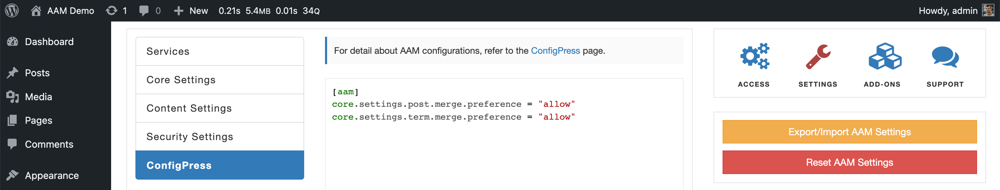

::: question
My posts are still not accessible after editing the AAM posts tag settings. I also have a similar issue with users that have multiple roles. I'd like to understand why.
:::

Access control ambiguity is a common issue for WordPress websites with complex content structures or [multi-role](/plugin/advanced-access-manager/setting/multi-role-support) setups. The best way to explain this issue is by a couple of examples.

Let's say we have a custom post type _Recipe_, and we organize them into custom taxonomies like _Types_, _Courses_, and _Tags_. By default, you need to restrict reading all recipes for all users except those belonging to the "Paid Members" role. The only exception is recipes that you tag with _Free Recipe_.

Typically, you would use the Posts & Terms service and [set the default access](/plugin/premium-complete-package/content-access/manage-access-to-post-types) to all _Recipes_. Then you override the access controls to the _Free Recipe_ tag by drilling down to the _Recipe_ post type.

However, you will immediately learn that despite following these steps, the majority of tagged recipes are still not accessible to users. It is because most recipes classify with few terms (e.g. _Breakfast_ and _Vegan_, or _Snack_ and _Dry Food_, etc.), and since you set the default access to the post type _Recipe_ - all the _terms_ and recipes [inherit these default controls](/question/content-access/wordpress-content-organization).

When AAM evaluates if a user can access the recipe, it faces the access controls ambiguity, because the term _Breakfast_ denies access to related recipes, and the _Free Recipe_ tag - allows it. In this situation, AAM follows the least privilege approach and denies access.

Very similar issue with multi-role setup. A single user may belong to two or more roles where one role allows access to a certain resource and another - denies it. In this situation, we again face access control ambiguity, and AAM similarly follows the least privilege approach.

Luckily, you have the ability to override this behavior for each individual resource type with [ConfigPress](/plugin/advanced-access-manager/configpress/) settings as follows.

```ini
[aam]
; Manage access preference to the Backend Menu
core.settings.menu.merge.preference = "allow"

; Manage access preference to the Top Admin Toolbar
core.settings.toolbar.merge.preference = "allow"

; Manage access preference to the Metaboxes & Widgets
core.settings.metabox.merge.preference = "allow"

; Manage access preference to posts, pages, media and any individual custom post type
core.settings.post.merge.preference = "allow"

; Manage access preference to terms
core.settings.term.merge.preference = "allow"

; Manage access preference to any post type like Posts, Pages, Products etc
core.settings.type.merge.preference = "allow"

; Manage access preference to any taxonomy object
core.settings.taxonomy.merge.preference = "allow"

; Manage access preference to URI Access
core.settings.uri.merge.preference = "allow"
```

From our example above with _Recipes_, we should change the access controls merging preference to allow access to resources when at least  _term_ or recipe explicitly permits access.

