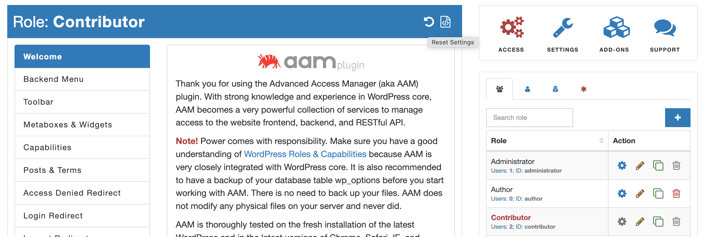
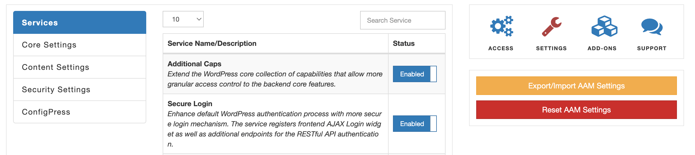

::: question Question
How can I reset AAM settings for a specific role or, when necessary,  reset all settings to default?
:::

There are three ways to reset AAM settings, depending on your particular needs. Below we'll cover them all.

::: warning Note!
AAM cannot reset changes to _roles_ and _capabilities_. If you delete any _role_ or _capability_, that is a permanent change. In this case, you need to recreate them manually or use your database backup to restore them.
:::

## Reset role or user settings

When you need to reset access control only for a role or individual user, switch to manage them and select the _Reset Settings_ button on the top status bar.



## Reset all AAM settings

Where there is a need to reset all AAM settings to default, navigate to the _Settings_ page and select the _Reset AAM Settings_ button.



## Delete AAM settings from DB

If your admin user lost access to the backend (because you made a mistake) and can't reset AAM settings with the UI, then you need to delete AAM settings from the DB.

AAM stores all the settings in the `_options` and `_usermeta` tables with the `aam_` prefix. You can connect to your MySQL database with preferred DB client and manually delete AAM records.

## Programmatically reset AAM settings

AAM has several ways to reset settings programmatically with its embedded API. Depending on your needs, you can choose snippets of the code that will do the trick.

When you need to reset settings for a role, user, visitors, or default access settings for all, use these methods respectively.

```php
AAM::api()->getRole($roleId)->reset();
AAM::api()->getUser($userId)->reset();
AAM::api()->getVisitor()->reset();
AAM::api()->getDefault()->reset();
```

When you need to reset all AAM settings (all users, roles, visitors, and default), then use the `reset` method as follows.

```php
AAM::api()->reset();
```